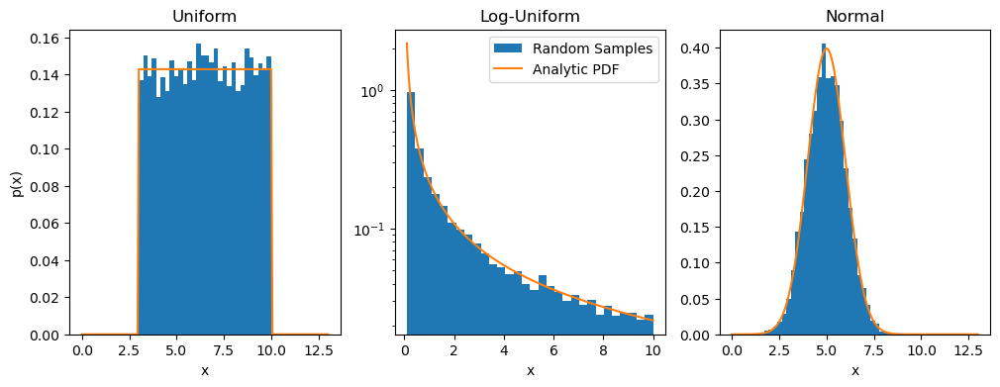

# Building Prior Distributions

Let's figure out how to construct some prior probability distributions!  Specifically, we will need to be able to do two important things:

1) Randomly generate numbers drawn from a defined probability density function (PDF),
2) Calculate the PDF value at specified values.

Fortunately for us, [*SciPy*](https://docs.scipy.org/doc/scipy/reference/stats.html) can do both of these things extremely easily, and they already have many, many defined PDFs that you might find useful!  Three common priors we will likely for our MCMCs are:

- [Uniform distributions](https://docs.scipy.org/doc/scipy/reference/generated/scipy.stats.uniform.html),
- [Log-Uniform distributions](https://docs.scipy.org/doc/scipy/reference/generated/scipy.stats.loguniform.html),
- and [Normal distributions](https://docs.scipy.org/doc/scipy/reference/generated/scipy.stats.norm.html).

Let's come up with a way to build some priors that we can then use in our MCMC.

## Prior Dictionary


```python
from tqdm import tqdm
import scipy.stats
import numpy as np
import matplotlib.pyplot as plt
```

Personally, I'm going to choose to build my MCMC priors using a dictionary structure.  You don't have to do it this way if you prefer a different method, this is a choice, but I do think it can be useful further down the road!


```python
# Define a dictionary to store the priors for 3 different parameters

priors = {
          0: scipy.stats.uniform(loc=3, scale=7),    # loc < x < loc + scale
          1: scipy.stats.loguniform(a=1e-1, b=1e1),  #   a < x < b
          2: scipy.stats.norm(loc=5, scale=1),       # loc = mean, scale = standard deviation
         }
```

And that's it!  The great thing about *SciPy*, is that each of these distributions are class objects with pre-defined functions.  Now we can draw random values from each of these prior distributions using the `.rvs` function, and we can evaluate the PDF of these distributions at specified values using `.pdf` function!


```python
fig, ax = plt.subplots(1,3,figsize=(12,4))

Nsamples = 10000

xvals1 = np.linspace(0,13,200)
xvals2 = np.logspace(-1,1,200)

# Parameter 0
ax[0].hist(priors[0].rvs(Nsamples), bins=30, density=True)  # Draw random samples from the distribution and plot them
ax[0].plot(xvals1, priors[0].pdf(xvals1))                   # Calculate the PDF at each specified number in the array

# Parameter 1
ax[1].hist(priors[1].rvs(Nsamples), bins=30, log=True, density=True, label='Random Samples')
ax[1].plot(xvals2, priors[1].pdf(xvals2), label='Analytic PDF')

# Parameter 2
ax[2].hist(priors[2].rvs(Nsamples), bins=30, density=True)
ax[2].plot(xvals1, priors[2].pdf(xvals1))

ax[0].set_title('Uniform'), ax[1].set_title('Log-Uniform'), ax[2].set_title('Normal')
ax[0].set_ylabel('p(x)'), ax[0].set_xlabel('x'), ax[1].set_xlabel('x'), ax[2].set_xlabel('x')
ax[1].legend()
plt.show()
```


    

    


## Prior Function

Now what we want is to define a prior function, where we can input MCMC parameter samples and output the resulting prior value.  A couple of notes about how we are going to set this up:

- We are going to define the 'log-prior' function, where the output of the function is actually the natural log of the prior.  This is a pretty common practice for MCMC authors, but not a necessary one.
- Sometimes we might have a parameter that must remain within hard boundaries.  Such is the case with uniformly distributed parameters, for example.  In these cases, if we input a value into our log-prior that steps outside of this boundary, we would like to return $-\infty$ (i.e. the probability of such a value should be $0$, so the log-probability should be $-\infty$.  Since working with "infinities" can sometimes get tricky when coding, we are going to achieve the same effect by just setting it to a non-infinite but extremely small negative number: $-10^{300}$.


```python
# Let's use the dictionary we defined above to construct our log-prior function

def lnprior(params):

    # Calculate the PDF value of each input parameter for it's corresponding prior distribution
    prior0 = priors[0].pdf(params[0])
    prior1 = priors[1].pdf(params[1])
    prior2 = priors[2].pdf(params[2])

    # !!Bouncary check!!
    # If any of the parameters land out of their boundary, let's automatically return an effective (numerical) -inf
    if (prior0 == 0) or (prior1 == 0) or (prior2 == 0):
        return -1e300
    # Otherwise, return the log of the combined prior distribution
    else:
        return np.log(prior0 * prior1 * prior2)
```

Here are some examples of our function in action:


```python
parameter_test1 = [3, 0.1, 6.2]
parameter_test2 = [2, 0.1, 6.2]  # Note: this one should fall out-of-bounds, because the first parameter value does not land inside of the Uniform Distribution!

print("Log-Prior of Parameter Samples 1: ", lnprior(parameter_test1))
print("Log-Prior of Parameter Samples 2: ", lnprior(parameter_test2))
```

    Log-Prior of Parameter Samples 1:  -2.8094432150738418
    Log-Prior of Parameter Samples 2:  -1e+300

