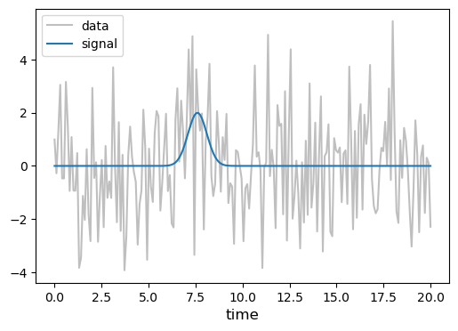
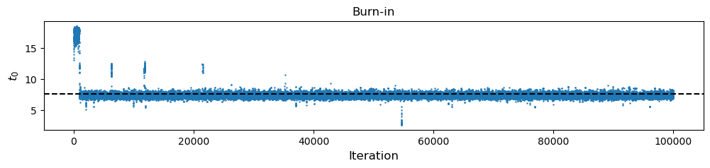
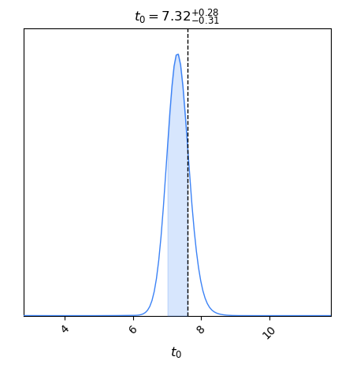
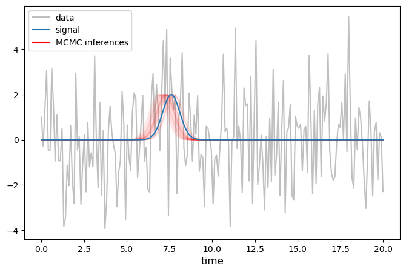
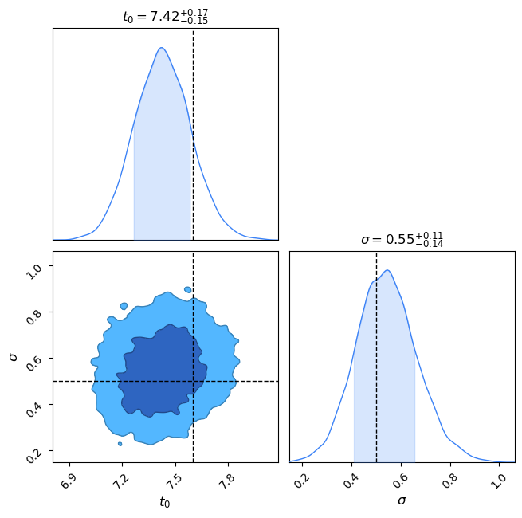
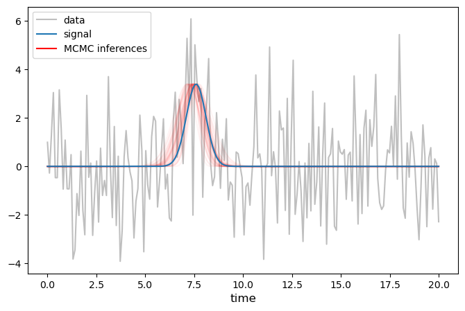
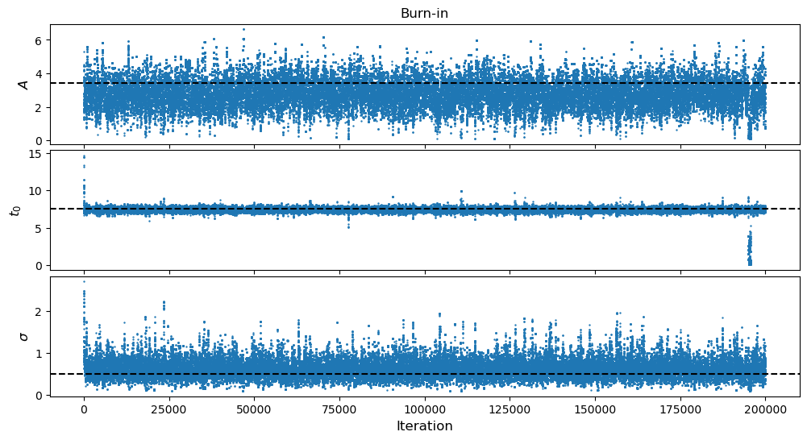
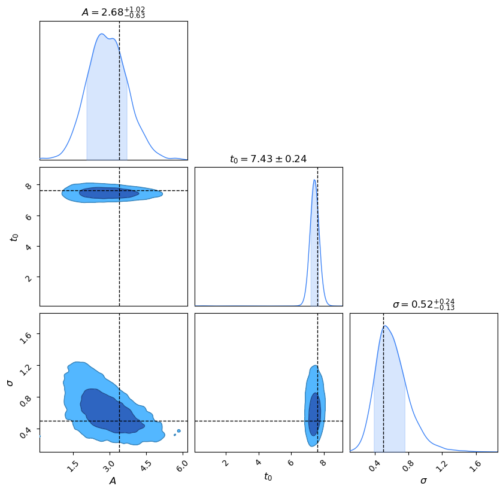

# MCMC 1

Alright, we finally have enough background to cook up our first MCMC!

## Ingredients

Here is the list of ingredients that we are going to use in this MCMC:

````{tab-set}

```{tab-item} Conveniences
- [x] progress tracking bar
- [ ] efficiency tracking diagnostics
    - [ ] in-model jump acceptance ratios
    - [ ] temperature swap acceptance ratios
- [ ] cyclic parameters
```

```{tab-item} Jump Proposals
- [x] symmetric jumps
    - [x] Gaussian/Multivariate Normal
- [ ] prior jumps
- [ ] block (gibbs) jumps
- [ ] multiple jump schemes
```

```{tab-item} MCMC Techniques
- [x] standard MCMC
- [ ] parallel tempering
- [ ] rejection sampling
```

````

## 1D Gaussian Bump

We will start with [The Gaussian Bump problem](../toy_problems.md#the-gaussian-bump).  Since this is our very first MCMC, we will start by making it a model of only one parameter $t_0$, by fixing the other two parameters $A=3.4$ and $\sigma = 0.5$!  We will repeat the exercise below two more times and add back in one additional parameter each time!

So the question we are essentially asking is, 

> "In the dataset we have observed, at what time $t_0$ do we think there is a 'bump' in the data?"


```python
from tqdm import tqdm  # progress bar
import scipy.stats
import numpy as np
import matplotlib.pyplot as plt
from matplotlib.lines import Line2D
import pandas as pd
from chainconsumer import ChainConsumer, Chain, Truth
```

### Generate the Dataset

First we need to create a dataset that we will perform our Bayesian analysis on!  We will:
1. code a function for the bump model
2. create an array of observation times
3. create a signal
4. generate the underlying noise
5. create the observed dataset


```python
# Define The Bump Model as a function of a single parameter: t0
def Model(t0, t):
    A     = 3.4
    sigma = 0.5
    return A*np.exp(-(t-t0)**2/(2*sigma**2))
```


```python
# Generate the array of times at which we observe the data
starttime = 0
endtime   = 20
Tobs      = endtime - starttime

Nt        = 200  # number of timing data
times     = np.linspace(starttime, endtime, Nt)
```


```python
# Create the signal

# Inject the true value of the parameter we will try to recover!
injection = 7.6

# calculate the signal from the model
signal    = Model(injection, times)
```

For the sake of replicability, let us set a random seed when generating the noise:


```python
# Generate noise
# --> this dataset has uncorrelated white noise

# Setting a random seed so that you can replicate the graphs
np.random.seed(42)

sigma_n = 2
noise   = np.random.normal(0, sigma_n, size=Nt)
```


```python
# Create the observed data
data = signal + noise
```

Let's take a quick look at what this data now looks like:


```python
fig, ax = plt.subplots(1,1,figsize=(6,4))

ax.plot(times, data,   color='gray', alpha=0.5, label='data')
ax.plot(times, signal, color='C0', label='signal')

ax.legend(), ax.set_xlabel('time', fontsize=12)
plt.show()
```


    

    


###  Prior and Likelihood

Next we need to write down our prior and likelihood that we described in [The Gaussian Bump](../toy_problems.md#the-gaussian-bump).

For the prior, we will stick to the same way we did it in [Building Prior Distributions](../building_priors/building_priors.md).  Since we are beginning with only the $t_0$ parameter, we just need a simple uniform prior bounded by our `starttime` and `endtime`.

For the likelihood, note that the normalization constant $\mathcal{N}$ does *not* depend on our model parameter value at all (i.e., it has no functional dependence on $t_0$).  That means the value of $\mathcal{N}$ will remain constant every time we calculate the terms in equation {eq}`acceptance_ratio_code`, therefore they will always cancel out.

> **So we don't need to worry about including the normalization in our definition of the likelihood function here for this MCMC algorithm.**


```python
# Define a dictionary to store the prior for our parameter

prior = {
         't0': scipy.stats.uniform(loc=starttime, scale=Tobs),    # loc < x < loc + scale
        }
```


```python
# Now use the dictionary to construct the log-prior function

def ln_prior(param):

    # Calculate the PDF value of the input parameter
    prior_t0 = prior['t0'].pdf(param)

    # !!Boundary check!!
    # If the parameter lands out of its boundary, let's automatically return an effective (numerical) -inf
    if prior_t0 == 0:
        return -1e300
    # Otherwise, return the log of the prior distribution
    else:
        return np.log(prior_t0)
```

Ok, next we define the log-likelihood function:


```python
# Define the unnormalized log-likelihood function.

def ln_like(param, data, sigma_n, times):
    M = Model(param, times)
    return (- (data - M)**2 / (2*sigma_n**2)).sum()
```

Let's do a couple of quick sanity checks, just to basically make sure that our functions are working the way we expect:


```python
print("Quick checks:")
print(r"--> log-prior of the injection      = {0:0.4f}".format(ln_prior(injection)))
print(r"--> log-prior out of prior range    = {0:0.4e}".format(ln_prior(endtime+0.0001)))
print(r"--> log-likelihood of the injection = {0:0.4f}".format(ln_like(injection, data, sigma_n, times)))
```

    Quick checks:
    --> log-prior of the injection      = -2.9957
    --> log-prior out of prior range    = -1.0000e+300
    --> log-likelihood of the injection = -86.4097


Ok everything seems fine, let's move on to defining our jump PDF!

### Jump Proposal

We only have one model parameter, and we are trying to keep things for our first MCMC, so let's stick with just the basic [Gaussian jump proposal](../building_jump_proposals.md#gaussian-jumps).  Remember, this type of jump proposal is a [symmetric jump proposal](../building_jump_proposals.md#symmetric-jump-proposals), which means that the forward and reverse jumps will have equal probability.  So in practice, this means that the ratio of the reverse to the forward jump found in the acceptance ratio criteria {eq}`acceptance_ratio_code` will always be identically $=1$.

To get in the good habit while learning, let's still code everything up!  It will make things easier going forward as we move on to more complicated jump proposals, where they won't always be symmetric.  So let's start by copying over the code we already wrote for our [Gaussian jump](../building_jump_proposals.md#gaussian-jumps):

```{margin}
We will discuss more later *how* to decide what the jump proposal's standard deviation should be, but for the moment I have just picked a value that I found seemed to work decently well.

But it is **critical** that the standard deviation in both the forward and reverse Gaussian jumps **are identical**!  Otherwise, the forward and reverse jumps are not the same, and they won't be symmetric.  Go ahead, test this out for yourself by chanding the value for `std = ...` below in only *one* of the two functions, and then run the **Sanity check** code box below that and see what happens!
```


```python
# The FORWARD jump proposal

def jump_F_Gaussian(sample_current):
    # standard deviation of the jump
    std = 1
    
    # draw a new random sample using the .RVS() method, and calculate the PDF value using the .PDF() method
    sample_proposed = scipy.stats.norm(loc=sample_current, scale=std).rvs()
    pdf_value       = scipy.stats.norm(loc=sample_current, scale=std).pdf(sample_proposed)
    
    return sample_proposed, pdf_value


# The REVERSE jump proposal

def jump_R_Gaussian(sample_current, sample_proposed):
    # standard deviation of the jump
    std = 1
    
    # draw a new random sample using the .RVS() method, and calculate the PDF value using the .PDF() method    
    pdf_value = scipy.stats.norm(loc=sample_proposed, scale=std).pdf(sample_current)
    
    return pdf_value
```

**Sanity Check:** Let's test out our two new functions and verify that they are indeed symmetric!


```python
# Pick a starting parameter value
old_sample = 3.783

# Propose a new parameter value + it's PDF value using the forward jump proposal
new_sample, PDF_forward = jump_F_Gaussian(old_sample)

# Now calculate what the reverse PDF value would be if we jump from the proposed parameter back to the current parameter
PDF_reverse = jump_R_Gaussian(old_sample, new_sample)

print("Current Sample  = {0:0.4f}".format(old_sample))
print("Proposed Sample = {0:0.4f}".format(new_sample))
print("PDF value of Proposed sample given Current  sample (FORWARD jump) = {0:0.4f}".format(PDF_forward))
print("PDF value of Current  sample given Proposed sample (REVERSE jump) = {0:0.4f}".format(PDF_reverse))
```

    Current Sample  = 3.7830
    Proposed Sample = 4.1408
    PDF value of Proposed sample given Current  sample (FORWARD jump) = 0.3742
    PDF value of Current  sample given Proposed sample (REVERSE jump) = 0.3742


### MCMC Algorithm

Alright, the moment is upon us!  We have everything we now need to fully construct our first MCMC algorithm!  We will follow our [pseudo-code outline](../mcmc_basics.md#pseudo-code-for-the-mcmc-algorithm) and our [schematic](../schematics/schematics.md#mcmc).

First we initialize our starting sample (in this problem, *we* are going to select the starting point), and we also define our MCMC data structure.


```python
# data structure 
Nsample = 200_000   # number of samples
Ndim    = 1         # number of model dimensions

# Initialize data arrays
x_samples = np.zeros((Nsample, Ndim))

# Starting sample
# --> (Pseudo-Code Step 1)
x_samples[0] = 13.4
```

We can achieve the steps in our [MCMC schematic](../schematics/schematics.md#mcmc) with a **single `for` loop**.  This loop will range over the number of samples that we want to draw $N_\text{samples}$.

Note, each step in our [pseudo-code](../mcmc_basics.md#pseudo-code-for-the-mcmc-algorithm) is indicated in the code comments.

After we propose a new jump, we add one additional step: the **"prior check."**  This step is not strictly necessary, but we know that if we were to propose a sample that lies outside of our parameter space, then we should not accept the jump to that parameter (because the log-prior has a (numerical) negative infinity, so our criteria equation {eq}`ln_acceptance_ratio_code` will never accept the proposal).  This check is really more useful if you have any parameters in your model where the prior forbids certain values - such as is the case with the Uniform prior that we have here!

```{caution}
Practically, I have also found that including this check sometimes will help avoid Python outputting certain *Warning* messages if/when certain parameter values are proposed that begin to cause numerical stability issues!
```


```python
# LOOP: Samples
for i in tqdm(range(1,Nsample)):

    # Current sample
    x_current = x_samples[i-1,:]

    # Propose NEW sample (and calculate it's FORWARD jump PDF)
    # --> (Pseudo-Code Steps 2, 3)
    x_proposed, Jump_proposed = jump_F_Gaussian(x_current)

    #-------------
    # Prior Check
    #-------------
    # If proposed sample is not allowed by prior, immediately reject the proposal (saves some computation)
    lnprior_proposed = ln_prior(x_proposed)
    
    if lnprior_proposed <= -1e300:
        # keep the current sample
        x_samples[i,:] = x_current
        
    #---------------------------
    # Acceptance Ratio Criteria
    #---------------------------
    # Calculate the log-prior, log-likelihood, and log-jump PDFs for the current and proposed samples
    # --> (Pseudo-Code Step 3)
    else:
        lnprior_current = ln_prior(x_current)
        
        lnlike_proposed = ln_like(x_proposed, data, sigma_n, times)
        lnlike_current  = ln_like(x_current,  data, sigma_n, times)

        lnjump_proposed = np.log( Jump_proposed )
        lnjump_current  = np.log( jump_R_Gaussian(x_current, x_proposed) )
    
        # Draw random number from Uniform Dist
        # --> (Pseudo-Code Step 4)
        U   = np.random.uniform(0,1)
        lnU = np.log(U)

        # Heart of the MCMC Algorithm: the acceptance criteria
        # --> (Pseudo-Code Step 5)
        if (lnprior_proposed - lnprior_current) + (lnlike_proposed - lnlike_current) + (lnjump_current - lnjump_proposed) > lnU:
            # accept the proposed sample
            x_samples[i,:] = x_proposed
        else:
            # keep the current sample
            x_samples[i,:] = x_current
```

    100%|█████████████████████████████████████████████████████████████████████████████████████████████████████████████| 199999/199999 [02:26<00:00, 1369.12it/s]


That's all there is to it!  The entire MCMC "black box" fits in the above code block.  Hopefully now that we have broken things down line-by-line, it isn't so daunting to understand.  We just cooked up a simple MCMC!

### Result Plots

Now let's take a look at our results, to see how well our MCMC sampler worked!


```python
# store the parameter label for reference in the plots below (just for convenience)
label = [r'$t_0$']
```


```python
#--------------
# Burn-in Plot
#--------------

fig, ax = plt.subplots(1,1,figsize=(12,2), sharex=True)
plt.subplots_adjust(hspace=0.05)

ax.scatter(np.arange(0,Nsample,1), x_samples, s=0.5)
ax.axhline(injection, color='k', linestyle='--')
ax.set_ylabel(label[0], fontsize=12), ax.set_xlabel('Iteration', fontsize=12)
ax.set_title('Burn-in')

plt.show()
```


    

    


Now that we have an idea of how long it took our sampler to burn-in, let's throw away the initial samples and make a histogram of our final posterior from the remaining samples!


```python
# Discard (burn) samples
burn = 25_000

# Final posterior samples
# --> we will save two copies of the final samples: 
#     (1) one as a Pandas DataFrame (specifically for the Chainconsumer plot below),
#     (2) and the other as a regular array structure

# Pandas data stucture
PD_samples_final = pd.DataFrame(data    = x_samples[burn:],  # discard the burn-in samples
                                columns = label
                                )
# Regular array structure
x_samples_final = np.asarray(PD_samples_final)
```

Create the final corner plot of the posterior samples.


```python
#-------------
# Corner Plot
#-------------

c = ChainConsumer()

chain = Chain(samples = PD_samples_final,
              columns = label,
              name    = "MCMC 1 (1 parameter)",
              )

c.add_chain(chain)

c.add_truth(Truth(location=dict(zip(label, np.asarray([injection]))), color='k'))

c.plotter.plot();
```


    

    


Let's also look examples of the MCMC inferences.


```python
#-----------------
# Inferences Plot
#-----------------

fig, ax = plt.subplots(1,1,figsize=(8,5))

ax.plot(times, data,   color='gray', alpha=0.5, label='data')

# Randomly select a subset of parameter samples
nselect = 50
indices = np.random.randint(len(x_samples_final), size=nselect)
# Now feed those parameters back into the model and see how they look plotted on our data
for ind in indices:
    model = Model(x_samples_final[ind,:], times)
    ax.plot(times, model, color='r', alpha=2/nselect)

ax.plot(times, signal, color='C0', label='signal')

# Manually add the 'MCMC inferences' line to the legend
handles, labels = ax.get_legend_handles_labels()
line = Line2D([0], [0], label='MCMC inferences', color='r')
handles.extend([line])

ax.legend(handles=handles), ax.set_xlabel('time', fontsize=12)
plt.show()
```


    

    


Looking at these three plots, I'd say things look pretty good!  The our MCMC sampler burned-in pretty quick and even though we started our initial parameter out in the 'wrong' part of parameter space, it quickly jumped around and found the 'truth' parameter value.

It should not be too surprising that the posterior samples are a little offset from the truth - this often happens.  And it is because there is noise in our data - noise will always bias things somewhat.  But in our case here, the 'truth' still falls close to the '$1\sigma$' range of the recovered posterior on $t_0$.

And when we plot some of the MCMC inferences, again we see there is a slight offset.  But actually, just looking at the noisy data itself, you might notice that there does appear to be a slightly larger noise fluctuation just to the left of the injected truth (for this *specific* noise realization), and that might be what is pushing the model of our bump a little over from where the truth signal lies!

## 2D Gaussian Bump

We have created our very first MCMC, but we also simplified our original three parameter model down to a model of only a single parameter, $t_0$.  Let's add back in the $\sigma$ parameter and figure out what we need to change!  Now let's fix only $A=3.4$, and allow the parameters $t_0$ and $\sigma$ to vary.  But apart from that we are not going to change anything else in our MCMC algorithm - we will still use the same list of [Ingredients](#ingredients)!

This is good practice when cooking our first MCMC - slowly build up in complexity, and run tests as we go, to make sure we understand how our sampler is behaving, and so that we trust our results!

```{attention}
For what follows, we will effectively copy/paste all of the code above that we wrote for our [1D Gaussian Bump problem](#1d-gaussian-bump) and use it again!  But necessarily we will have to change a handful of things to now accomodate a model with *two* parameters - so I will point those out as we go!
```


```python
from tqdm import tqdm  # progress bar
import scipy.stats
import numpy as np
import matplotlib.pyplot as plt
from matplotlib.lines import Line2D
import pandas as pd
from chainconsumer import ChainConsumer, Chain, Truth
```

### Generate the Dataset

First we need to create a dataset that we will perform our Bayesian analysis on!  We will:
1. code a function for the bump model
2. create an array of observation times
3. create a signal
4. generate the underlying noise
5. create the observed dataset

```{margin}
Now our `Model` function takes two parameters and a time value as it's input!
```


```python
# Define The Bump Model as a function of the two parameters t0 and sigma
def Model(t0, sigma, t):
    A = 3.4
    return A*np.exp(-(t-t0)**2/(2*sigma**2))
```


```python
# Generate the array of times at which we observe the data
starttime = 0
endtime   = 20
Tobs      = endtime - starttime

Nt        = 200  # number of timing data
times     = np.linspace(starttime, endtime, Nt)
```

```{margin}
Let's now save our injected true parameters for $t_0$ and $\sigma$ as a list.  When we feed that list into our model, we need to 'unpack' it (the '*' notation).
```


```python
# Create the signal

# Inject the true value of the parameters we will try to recover!
injection = [7.6, 0.5]

# calculate the signal from the model
signal    = Model(*injection, times)
```

For the sake of replicability, let us set a random seed when generating the noise:


```python
# Generate noise
# --> this dataset has uncorrelated white noise

# Setting a random seed so that you can replicate the graphs
np.random.seed(42)

sigma_n = 2
noise   = np.random.normal(0, sigma_n, size=Nt)
```


```python
# Create the observed data
data = signal + noise
```

Let's take a quick look at what this data now looks like:


```python
fig, ax = plt.subplots(1,1,figsize=(6,4))

ax.plot(times, data,   color='gray', alpha=0.5, label='data')
ax.plot(times, signal, color='C0', label='signal')

ax.legend(), ax.set_xlabel('time', fontsize=12)
plt.show()
```


    

    


###  Prior and Likelihood

Next we need to write down our prior and likelihood that we described in [The Gaussian Bump](../toy_problems.md#the-gaussian-bump).

With regards to the likelihood,
> **we still don't need to worry about including the normalization in our definition of the likelihood function here, for the reason we explained above in the 1D problem.**


```{margin}
For the prior, we continue to stick to the same way we did it in [Building Prior Distributions](../building_priors/building_priors.md).  Now we are adding in a log-uniform prior for $\sigma$.  And since we are assuming these are independent model parameters, the final joint prior is just the multiplication of the uniform prior on $t_0$ and the log-uniform prior on $\sigma$.
```


```python
# Define a dictionary to store the prior for our parameter

prior = {
         't0':    scipy.stats.uniform(loc=starttime, scale=Tobs),    # loc < x < loc + scale
         'sigma': scipy.stats.loguniform(a=1e-1, b=1e1),             #   a < x < b
        }
```


```python
# Now use the dictionary to construct the log-prior function

def ln_prior(param):

    t0, sigma = param

    # Calculate the PDF value of the input parameter
    prior_t0    = prior['t0'].pdf(t0)
    prior_sigma = prior['sigma'].pdf(sigma)

    # !!Boundary check!!
    # If the parameters land out of their boundaries, let's automatically return an effective (numerical) -inf
    if (prior_t0 == 0) or (prior_sigma == 0):
        return -1e300
    # Otherwise, return the log of the prior distribution
    else:
        return np.log(prior_t0 * prior_sigma)
```

Ok, next we define the log-likelihood function:


```python
# Define the unnormalized log-likelihood function.

def ln_like(param, data, sigma_n, times):
    M = Model(*param, times)
    return (- (data - M)**2 / (2*sigma_n**2)).sum()
```

Let's do a couple of quick sanity checks, just to basically make sure that our functions are working the way we expect:


```python
print("Quick checks:")
print(r"--> log-prior of the injection      = {0:0.4f}".format(ln_prior(injection)))
print(r"--> log-prior out of prior range    = {0:0.4e}".format(ln_prior([endtime+0.0001, 4.03])))
print(r"--> log-likelihood of the injection = {0:0.4f}".format(ln_like(injection, data, sigma_n, times)))
```

    Quick checks:
    --> log-prior of the injection      = -3.8298
    --> log-prior out of prior range    = -1.0000e+300
    --> log-likelihood of the injection = -86.4097


Ok everything seems fine, let's move on to defining our jump PDF!

### Jump Proposal

```{attention}
Now here is where we do need to make an important alteration from our 1D problem.  Now we have two parameters, so we need to be able to draw random samples on two parameters simultaneously, and calculate their jump PDF values.  We are still trying to keep things simple for this MCMC, so let's just generalize from the [Gaussian jump proposal](../building_jump_proposals.md#gaussian-jumps) to the [Multivariate Normal jump proposal](../building_jump_proposals.md#multivariate-normal-jumps).
```

Remember, this type of jump proposal is also a [symmetric jump proposal](../building_jump_proposals.md#symmetric-jump-proposals), which means that the forward and reverse jumps will have equal probability.  So in practice, this means that the ratio of the reverse to the forward jump found in the acceptance ratio criteria {eq}`acceptance_ratio_code` will always be identically $=1$.

But we are still going to code it all up - it's a good habit for learning!  So let's start by copying over the code we already wrote for our [Multivariate Normal jump proposal](../building_jump_proposals.md#multivariate-normal-jumps):

```{margin}
We will discuss more later *how* to decide what the jump proposal's Covariance matrix should be, but for the moment I have just picked a value that I found seemed to work decently well.

But it is **critical** that the standard deviation in both the forward and reverse Gaussian jumps **are identical**!  Otherwise, the forward and reverse jumps are not the same, and they won't be symmetric.  Go ahead, test this out for yourself by chanding the values in `Cov = ...` below in only *one* of the two functions, and then run the **Sanity check** code box below that and see what happens!
```


```python
# The FORWARD jump proposal

def jump_F_MultivariateNorm(sample_current):
    # Covariance matrix that set's each parameter's jump scale
    Cov = np.array([[1, 0  ],
                    [0, 0.6]])
    
    # draw a new random sample using the .RVS() method, and calculate the PDF value using the .PDF() method
    sample_proposed = scipy.stats.multivariate_normal(mean=np.array(sample_current), cov=Cov).rvs()
    pdf_value       = scipy.stats.multivariate_normal(mean=np.array(sample_current), cov=Cov).pdf(sample_proposed)
    
    return sample_proposed, pdf_value


# The REVERSE jump proposal

def jump_R_MultivariateNorm(sample_current, sample_proposed):
    # standard deviation of the jump
    Cov = np.array([[1, 0  ],
                    [0, 0.6]])
    
    # draw a new random sample using the .RVS() method, and calculate the PDF value using the .PDF() method    
    pdf_value = scipy.stats.multivariate_normal(mean=np.array(sample_proposed), cov=Cov).pdf(sample_current)
    
    return pdf_value
```

**Sanity Check:** Let's test out our two new functions and verify that they are indeed symmetric!


```python
# Pick a starting parameter value
old_sample = [3.783, 1.2]

# Propose a new parameter value + it's PDF value using the forward jump proposal
new_sample, PDF_forward = jump_F_MultivariateNorm(old_sample)

# Now calculate what the reverse PDF value would be if we jump from the proposed parameter back to the current parameter
PDF_reverse = jump_R_MultivariateNorm(old_sample, new_sample)

print("Current Sample  =", old_sample)
print("Proposed Sample =", new_sample)
print("PDF value of Proposed sample given Current  sample (FORWARD jump) = {0:0.4f}".format(PDF_forward))
print("PDF value of Current  sample given Proposed sample (REVERSE jump) = {0:0.4f}".format(PDF_reverse))
```

    Current Sample  = [3.783, 1.2]
    Proposed Sample = [4.14078736 1.63438183]
    PDF value of Proposed sample given Current  sample (FORWARD jump) = 0.1647
    PDF value of Current  sample given Proposed sample (REVERSE jump) = 0.1647


### MCMC Algorithm

Let's run our same MCMC algorithm as before, but now with two parameters!  We will follow our [pseudo-code outline](../mcmc_basics.md#pseudo-code-for-the-mcmc-algorithm) and our [schematic](../schematics/schematics.md#mcmc).

First we initialize our starting sample (in this problem, *we* are going to select the starting point), and we also define our MCMC data structure.

```{margin}
Update our model dimension to $N_\text{dim} = 2$, and pick the starting values of *both* of our parameters!
```


```python
# data structure 
Nsample = 200_000   # number of samples
Ndim    = 2         # number of model dimensions

# Initialize data arrays
x_samples = np.zeros((Nsample, Ndim))

# Starting sample
# --> (Pseudo-Code Step 1)
x_samples[0] = [13.4, 2.7]
```

We can achieve the steps in our [MCMC schematic](../schematics/schematics.md#mcmc) with a **single `for` loop**.  This loop will range over the number of samples that we want to draw $N_\text{samples}$.

Note, each step in our [pseudo-code](../mcmc_basics.md#pseudo-code-for-the-mcmc-algorithm) is indicated in the code comments.

After we propose a new jump, we add one additional step: the **"prior check."**  This step is not strictly necessary, but we know that if we were to propose a sample that lies outside of our parameter space, then we should not accept the jump to that parameter (because the log-prior has a (numerical) negative infinity, so our criteria equation {eq}`ln_acceptance_ratio_code` will never accept the proposal).  This check is really more useful if you have any parameters in your model where the prior forbids certain values!

```{attention}
Thanks to the way we have set things up here so far, the *ONLY* thing that we need to change in the code block below is the name of the jump proposal function that we are now using: 

`jump_F_Gaussian` $\rightarrow$ `jump_F_MultivariateNorm` 

and 

`jump_R_Gaussian` $\rightarrow$ `jump_R_MultivariateNorm`.
```


```python
# LOOP: Samples
for i in tqdm(range(1,Nsample)):

    # Current sample
    x_current = x_samples[i-1,:]

    # Propose NEW sample (and calculate it's FORWARD jump PDF)
    # --> (Pseudo-Code Steps 2, 3)
    x_proposed, Jump_proposed = jump_F_MultivariateNorm(x_current)

    #-------------
    # Prior Check
    #-------------
    # If proposed sample is not allowed by prior, immediately reject the proposal (saves some computation)
    lnprior_proposed = ln_prior(x_proposed)
    
    if lnprior_proposed <= -1e300:
        # keep the current sample
        x_samples[i,:] = x_current
        
    #---------------------------
    # Acceptance Ratio Criteria
    #---------------------------
    # Calculate the log-prior, log-likelihood, and log-jump PDFs for the current and proposed samples
    # --> (Pseudo-Code Step 3)
    else:
        lnprior_current = ln_prior(x_current)
        
        lnlike_proposed = ln_like(x_proposed, data, sigma_n, times)
        lnlike_current  = ln_like(x_current,  data, sigma_n, times)

        lnjump_proposed = np.log( Jump_proposed )
        lnjump_current  = np.log( jump_R_MultivariateNorm(x_current, x_proposed) )
    
        # Draw random number from Uniform Dist
        # --> (Pseudo-Code Step 4)
        U   = np.random.uniform(0,1)
        lnU = np.log(U)

        # Heart of the MCMC Algorithm: the acceptance criteria
        # --> (Pseudo-Code Step 5)
        if (lnprior_proposed - lnprior_current) + (lnlike_proposed - lnlike_current) + (lnjump_current - lnjump_proposed) > lnU:
            # accept the proposed sample
            x_samples[i,:] = x_proposed
        else:
            # keep the current sample
            x_samples[i,:] = x_current
```

    100%|█████████████████████████████████████████████████████████████████████████████████████████████████████████████| 199999/199999 [00:54<00:00, 3680.03it/s]


That's all there is to it!  The entire MCMC "black box" fits in the above code block.  Hopefully now that we have broken things down line-by-line, it isn't so daunting to understand.  We just cooked up a simple MCMC!

...And it now works for a multi-dimensional model!

### Result Plots

Now let's take a look at our results, to see how well our MCMC sampler worked!

```{attention}
Only a few tweaks need to be made to our plot code below.  Since we have multiple parameters, we will adjust our code to loop over those parameters where appropriate.

We will also try to 'future-proof' the code a bit more here, and write things generally for any $N_\text{dim}$ number of parameters in our model, so that we can come back to this and just copy/paste for our later MCMCs!
```


```python
# store the parameter labels for reference in the plots below (just for convenience)
label = [r'$t_0$', r'$\sigma$']
```


```python
#--------------
# Burn-in Plot
#--------------

fig, ax = plt.subplots(Ndim,1,figsize=(12,2*Ndim), sharex=True)
plt.subplots_adjust(hspace=0.05)

for i in range(Ndim):
    ax[i].scatter(np.arange(0,Nsample,1), x_samples[:,i], s=0.5)
    ax[i].axhline(injection[i], color='k', linestyle='--')
    ax[i].set_ylabel(label[i], fontsize=12)

ax[-1].set_xlabel('Iteration', fontsize=12)
ax[0].set_title('Burn-in')

plt.show()
```


    

    


Now that we have an idea of how long it took our sampler to burn-in, let's throw away the initial samples and make a histogram of our final posterior from the remaining samples!


```python
# Discard (burn) samples
burn = 25_000

# Final posterior samples
# --> we will save two copies of the final samples: 
#     (1) one as a Pandas DataFrame (specifically for the Chainconsumer plot below),
#     (2) and the other as a regular array structure

# Pandas data stucture
PD_samples_final = pd.DataFrame(data    = x_samples[burn:],  # discard the burn-in samples
                                columns = label
                                )
# Regular array structure
x_samples_final = np.asarray(PD_samples_final)
```

Create the final corner plot of the posterior samples.


```python
#-------------
# Corner Plot
#-------------

c = ChainConsumer()

chain = Chain(samples = PD_samples_final,
              columns = label,
              name    = "MCMC 1 (2 parameters)",
              )

c.add_chain(chain)

c.add_truth(Truth(location=dict(zip(label, np.asarray(injection))), color='k'))

c.plotter.plot();
```


    

    


Let's also look examples of the MCMC inferences.


```python
#-----------------
# Inferences Plot
#-----------------

fig, ax = plt.subplots(1,1,figsize=(8,5))

ax.plot(times, data,   color='gray', alpha=0.5, label='data')

# Randomly select a subset of parameter samples
nselect = 50
indices = np.random.randint(len(x_samples_final), size=nselect)
# Now feed those parameters back into the model and see how they look plotted on our data
for ind in indices:
    model = Model(*x_samples_final[ind,:], times)
    ax.plot(times, model, color='r', alpha=2/nselect)

ax.plot(times, signal, color='C0', label='signal')

# Manually add the 'MCMC inferences' line to the legend
handles, labels = ax.get_legend_handles_labels()
line = Line2D([0], [0], label='MCMC inferences', color='r')
handles.extend([line])

ax.legend(handles=handles), ax.set_xlabel('time', fontsize=12)
plt.show()
```


    

    


Nice, all of our updates from a one parameter model to a two parameter model seemed to have worked!  We are getting similar looking results as to what we had before in our [1D Gaussian problem](#1d-gaussian-bump), but now we have the posterior on the $\sigma$ parameter as well!

Looking at these three plots, I'd say things still look pretty good by eye!

## 3D Gaussian Bump

Alright, now that we have practiced running our MCMC on slightly simplified versions of our original [Gaussian bump model](../toy_problems.md#the-gaussian-bump), we are ready to run it on the full model - let's vary all three parameters $A$, $t_0$, and $\sigma$!

```{attention}
For what follows, we will effectively copy/paste all of the code above that we wrote for our [2D Gaussian Bump problem](#2d-gaussian-bump) and use it again!
```


```python
from tqdm import tqdm  # progress bar
import scipy.stats
import numpy as np
import matplotlib.pyplot as plt
from matplotlib.lines import Line2D
import pandas as pd
from chainconsumer import ChainConsumer, Chain, Truth
```

### Generate the Dataset

First we need to create a dataset that we will perform our Bayesian analysis on!  We will:
1. code a function for the bump model
2. create an array of observation times
3. create a signal
4. generate the underlying noise
5. create the observed dataset

```{margin}
Now our `Model` function takes three parameters and a time value as it's input!
```


```python
# Define The Bump Model as a function of the three parameters A, t0, and sigma
def Model(A, t0, sigma, t):
    return A*np.exp(-(t-t0)**2/(2*sigma**2))
```


```python
# Generate the array of times at which we observe the data
starttime = 0
endtime   = 20
Tobs      = endtime - starttime

Nt        = 200  # number of timing data
times     = np.linspace(starttime, endtime, Nt)
```

```{margin}
Let's now save our injected true parameters for $A$, $t_0$, and $\sigma$ as a list.  When we feed that list into our model, we need to 'unpack' it (the '*' notation).
```


```python
# Create the signal

# Inject the true value of the parameters we will try to recover!
injection = [3.4, 7.6, 0.5]

# calculate the signal from the model
signal    = Model(*injection, times)
```

For the sake of replicability, let us set a random seed when generating the noise:


```python
# Generate noise
# --> this dataset has uncorrelated white noise

# Setting a random seed so that you can replicate the graphs
np.random.seed(42)

sigma_n = 2
noise   = np.random.normal(0, sigma_n, size=Nt)
```


```python
# Create the observed data
data = signal + noise
```

Let's take a quick look at what this data now looks like:


```python
fig, ax = plt.subplots(1,1,figsize=(6,4))

ax.plot(times, data,   color='gray', alpha=0.5, label='data')
ax.plot(times, signal, color='C0', label='signal')

ax.legend(), ax.set_xlabel('time', fontsize=12)
plt.show()
```


    

    


###  Prior and Likelihood

Next we need to write down our prior and likelihood that we described in [The Gaussian Bump](../toy_problems.md#the-gaussian-bump).

With regards to the likelihood,
> **we still don't need to worry about including the normalization in our definition of the likelihood function here, for the reason we explained above in the 1D problem.**


```{margin}
For the prior, we continue to stick to the same way we did it in [Building Prior Distributions](../building_priors/building_priors.md).  Now we are adding in a log-uniform prior for $A$.  And since we are assuming these are independent model parameters, the final joint prior is just the multiplication of the log-uniform prior on $A$, uniform prior on $t_0$, and the log-uniform prior on $\sigma$.
```


```python
# Define a dictionary to store the prior for our parameter

prior = {
         'A':     scipy.stats.loguniform(a=1e-1, b=1e1),             #   a < x < b
         't0':    scipy.stats.uniform(loc=starttime, scale=Tobs),    # loc < x < loc + scale
         'sigma': scipy.stats.loguniform(a=1e-1, b=1e1),             #   a < x < b
        }
```


```python
# Now use the dictionary to construct the log-prior function

def ln_prior(param):

    A, t0, sigma = param

    # Calculate the PDF value of the input parameter
    prior_A     = prior['A'].pdf(A)
    prior_t0    = prior['t0'].pdf(t0)
    prior_sigma = prior['sigma'].pdf(sigma)

    # !!Boundary check!!
    # If the parameters land out of their boundaries, let's automatically return an effective (numerical) -inf
    if (prior_A == 0) or (prior_t0 == 0) or (prior_sigma == 0):
        return -1e300
    # Otherwise, return the log of the prior distribution
    else:
        return np.log(prior_A * prior_t0 * prior_sigma)
```

Ok, next we define the log-likelihood function:


```python
# Define the unnormalized log-likelihood function.

def ln_like(param, data, sigma_n, times):
    M = Model(*param, times)
    return (- (data - M)**2 / (2*sigma_n**2)).sum()
```

Let's do a couple of quick sanity checks, just to basically make sure that our functions are working the way we expect:


```python
print("Quick checks:")
print(r"--> log-prior of the injection      = {0:0.4f}".format(ln_prior(injection)))
print(r"--> log-prior out of prior range    = {0:0.4e}".format(ln_prior([1.78, endtime+0.0001, 4.03])))
print(r"--> log-likelihood of the injection = {0:0.4f}".format(ln_like(injection, data, sigma_n, times)))
```

    Quick checks:
    --> log-prior of the injection      = -6.5807
    --> log-prior out of prior range    = -1.0000e+300
    --> log-likelihood of the injection = -86.4097


Ok everything seems fine, let's move on to defining our jump PDF!

### Jump Proposal

```{attention}
Now we have three parameters, so like before we will stick with a simple symmetric [Multivariate Normal jump proposal](../building_jump_proposals.md#multivariate-normal-jumps) for this MCMC.
```

Remember, this type of jump proposal is also a [symmetric jump proposal](../building_jump_proposals.md#symmetric-jump-proposals), which means that the forward and reverse jumps will have equal probability.  So in practice, this means that the ratio of the reverse to the forward jump found in the acceptance ratio criteria {eq}`acceptance_ratio_code` will always be identically $=1$.

But we are still going to code it all up - it's a good habit for learning!  So let's start by copying over the code we already wrote for our [Multivariate Normal jump proposal](../building_jump_proposals.md#multivariate-normal-jumps):

```{margin}
We will discuss more later *how* to decide what the jump proposal's Covariance matrix should be, but for the moment I have just picked a value that I found seemed to work decently well.

But it is **critical** that the standard deviation in both the forward and reverse Gaussian jumps **are identical**!  Otherwise, the forward and reverse jumps are not the same, and they won't be symmetric.  Go ahead, test this out for yourself by chanding the values in `Cov = ...` below in only *one* of the two functions, and then run the **Sanity check** code box below that and see what happens!
```


```python
# The FORWARD jump proposal

def jump_F_MultivariateNorm(sample_current):
    # Covariance matrix that set's each parameter's jump scale
    Cov = np.array([[0.4, 0, 0   ],
                    [0,   1, 0   ],
                    [0,   0, 0.06]])
    
    # draw a new random sample using the .RVS() method, and calculate the PDF value using the .PDF() method
    sample_proposed = scipy.stats.multivariate_normal(mean=np.array(sample_current), cov=Cov).rvs()
    pdf_value       = scipy.stats.multivariate_normal(mean=np.array(sample_current), cov=Cov).pdf(sample_proposed)
    
    return sample_proposed, pdf_value


# The REVERSE jump proposal

def jump_R_MultivariateNorm(sample_current, sample_proposed):
    # standard deviation of the jump
    Cov = np.array([[0.4, 0, 0   ],
                    [0,   1, 0   ],
                    [0,   0, 0.06]])
    
    # draw a new random sample using the .RVS() method, and calculate the PDF value using the .PDF() method    
    pdf_value = scipy.stats.multivariate_normal(mean=np.array(sample_proposed), cov=Cov).pdf(sample_current)
    
    return pdf_value
```

**Sanity Check:** Let's test out our two new functions and verify that they are indeed symmetric!


```python
# Pick a starting parameter value
old_sample = [4.1, 3.783, 1.2]

# Propose a new parameter value + it's PDF value using the forward jump proposal
new_sample, PDF_forward = jump_F_MultivariateNorm(old_sample)

# Now calculate what the reverse PDF value would be if we jump from the proposed parameter back to the current parameter
PDF_reverse = jump_R_MultivariateNorm(old_sample, new_sample)

print("Current Sample  =", old_sample)
print("Proposed Sample =", new_sample)
print("PDF value of Proposed sample given Current  sample (FORWARD jump) = {0:0.4f}".format(PDF_forward))
print("PDF value of Current  sample given Proposed sample (REVERSE jump) = {0:0.4f}".format(PDF_reverse))
```

    Current Sample  = [4.1, 3.783, 1.2]
    Proposed Sample = [4.45467128 4.14078736 1.46529229]
    PDF value of Proposed sample given Current  sample (FORWARD jump) = 0.1827
    PDF value of Current  sample given Proposed sample (REVERSE jump) = 0.1827


### MCMC Algorithm

Let's run our same MCMC algorithm as before, but now with three parameters!  We will follow our [pseudo-code outline](../mcmc_basics.md#pseudo-code-for-the-mcmc-algorithm) and our [schematic](../schematics/schematics.md#mcmc).

First we initialize our starting sample (in this problem, *we* are going to select the starting point), and we also define our MCMC data structure.

```{margin}
Update our model dimension to $N_\text{dim} = 3$, and pick the starting values for all three of our parameters!
```


```python
# data structure 
Nsample = 200_000   # number of samples
Ndim    = 3         # number of model dimensions

# Initialize data arrays
x_samples = np.zeros((Nsample, Ndim))

# Starting sample
# --> (Pseudo-Code Step 1)
x_samples[0] = [5.3, 13.4, 2.7]
```

We can achieve the steps in our [MCMC schematic](../schematics/schematics.md#mcmc) with a **single `for` loop**.  This loop will range over the number of samples that we want to draw $N_\text{samples}$.

Note, each step in our [pseudo-code](../mcmc_basics.md#pseudo-code-for-the-mcmc-algorithm) is indicated in the code comments.

After we propose a new jump, we add one additional step: the **"prior check."**  This step is not strictly necessary, but we know that if we were to propose a sample that lies outside of our parameter space, then we should not accept the jump to that parameter (because the log-prior has a (numerical) negative infinity, so our criteria equation {eq}`ln_acceptance_ratio_code` will never accept the proposal).  This check is really more useful if you have any parameters in your model where the prior forbids certain values!


```python
# LOOP: Samples
for i in tqdm(range(1,Nsample)):

    # Current sample
    x_current = x_samples[i-1,:]

    # Propose NEW sample (and calculate it's FORWARD jump PDF)
    # --> (Pseudo-Code Steps 2, 3)
    x_proposed, Jump_proposed = jump_F_MultivariateNorm(x_current)

    #-------------
    # Prior Check
    #-------------
    # If proposed sample is not allowed by prior, immediately reject the proposal (saves some computation)
    lnprior_proposed = ln_prior(x_proposed)
    
    if lnprior_proposed <= -1e300:
        # keep the current sample
        x_samples[i,:] = x_current
        
    #---------------------------
    # Acceptance Ratio Criteria
    #---------------------------
    # Calculate the log-prior, log-likelihood, and log-jump PDFs for the current and proposed samples
    # --> (Pseudo-Code Step 3)
    else:
        lnprior_current = ln_prior(x_current)
        
        lnlike_proposed = ln_like(x_proposed, data, sigma_n, times)
        lnlike_current  = ln_like(x_current,  data, sigma_n, times)

        lnjump_proposed = np.log( Jump_proposed )
        lnjump_current  = np.log( jump_R_MultivariateNorm(x_current, x_proposed) )
    
        # Draw random number from Uniform Dist
        # --> (Pseudo-Code Step 4)
        U   = np.random.uniform(0,1)
        lnU = np.log(U)

        # Heart of the MCMC Algorithm: the acceptance criteria
        # --> (Pseudo-Code Step 5)
        if (lnprior_proposed - lnprior_current) + (lnlike_proposed - lnlike_current) + (lnjump_current - lnjump_proposed) > lnU:
            # accept the proposed sample
            x_samples[i,:] = x_proposed
        else:
            # keep the current sample
            x_samples[i,:] = x_current
```

    100%|█████████████████████████████████████████████████████████████████████████████████████████████████████████████| 199999/199999 [01:14<00:00, 2691.06it/s]


That's all there is to it!  The entire MCMC "black box" fits in the above code block.  Hopefully now that we have broken things down line-by-line, it isn't so daunting to understand.  We just cooked up a simple MCMC!

...And it now works for the full three-dimensional model!

### Result Plots

Now let's take a look at our results, to see how well our MCMC sampler worked!

```{attention}
Thanks to our 'future-proofing' we did above in [the plots for our 2D model](#result-plots-1), we can just add the new parameter label for $A$, and copy/paste the code without any additional updates!
```


```python
# store the parameter labels for reference in the plots below (just for convenience)
label = [r'$A$', r'$t_0$', r'$\sigma$']
```


```python
#--------------
# Burn-in Plot
#--------------

fig, ax = plt.subplots(Ndim,1,figsize=(12,2*Ndim), sharex=True)
plt.subplots_adjust(hspace=0.05)

for i in range(Ndim):
    ax[i].scatter(np.arange(0,Nsample,1), x_samples[:,i], s=0.5)
    ax[i].axhline(injection[i], color='k', linestyle='--')
    ax[i].set_ylabel(label[i], fontsize=12)

ax[-1].set_xlabel('Iteration', fontsize=12)
ax[0].set_title('Burn-in')

plt.show()
```


    

    


Now that we have an idea of how long it took our sampler to burn-in, let's throw away the initial samples and make a histogram of our final posterior from the remaining samples!


```python
# Discard (burn) samples
burn = 25_000

# Final posterior samples
# --> we will save two copies of the final samples: 
#     (1) one as a Pandas DataFrame (specifically for the Chainconsumer plot below),
#     (2) and the other as a regular array structure

# Pandas data stucture
PD_samples_final = pd.DataFrame(data    = x_samples[burn:],  # discard the burn-in samples
                                columns = label
                                )
# Regular array structure
x_samples_final = np.asarray(PD_samples_final)
```

Create the final corner plot of the posterior samples.


```python
#-------------
# Corner Plot
#-------------

c = ChainConsumer()

chain = Chain(samples = PD_samples_final,
              columns = label,
              name    = "MCMC 1 (3 parameters)",
              )

c.add_chain(chain)

c.add_truth(Truth(location=dict(zip(label, np.asarray(injection))), color='k'))

c.plotter.plot();
```


    

    


Let's also look examples of the MCMC inferences.


```python
#-----------------
# Inferences Plot
#-----------------

fig, ax = plt.subplots(1,1,figsize=(8,5))

ax.plot(times, data,   color='gray', alpha=0.5, label='data')

# Randomly select a subset of parameter samples
nselect = 50
indices = np.random.randint(len(x_samples_final), size=nselect)
# Now feed those parameters back into the model and see how they look plotted on our data
for ind in indices:
    model = Model(*x_samples_final[ind,:], times)
    ax.plot(times, model, color='r', alpha=2/nselect)

ax.plot(times, signal, color='C0', label='signal')

# Manually add the 'MCMC inferences' line to the legend
handles, labels = ax.get_legend_handles_labels()
line = Line2D([0], [0], label='MCMC inferences', color='r')
handles.extend([line])

ax.legend(handles=handles), ax.set_xlabel('time', fontsize=12)
plt.show()
```


    

    


We've reached our conclusion now of setting up our very first MCMC.  It can fully sample the posterior for all of the parameters that appear in the model, and the results we are getting look pretty good by eye!
