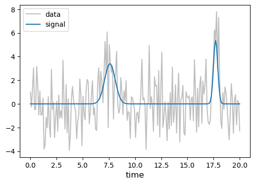
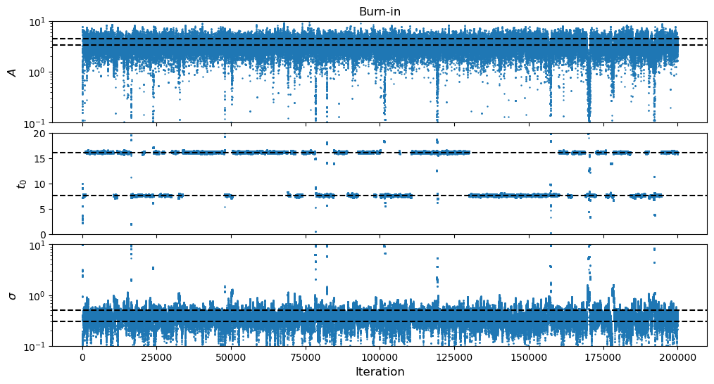
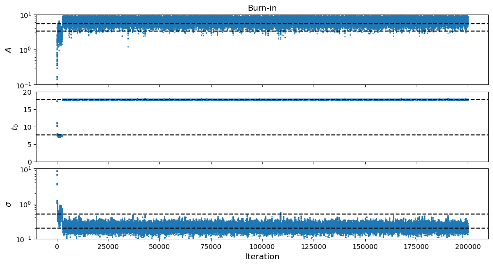
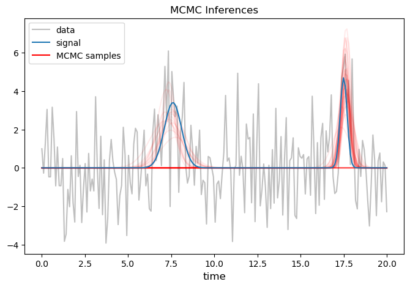

# MCMC: Multi-Bump

Let's return to "The Bump" problem.  This time we are going to practice building in **multiple jump schemes**, and also make the problem a little harder than it was the first time by adding multiple bumps...

## Ingredients

Here are the ingredients that we are going to use in this MCMC:

````{tab-set}

```{tab-item} MCMC Techniques
- [x] standard MCMC
- [ ] parallel tempering
- [ ] rejection sampling
```

```{tab-item} Conveniences
- [x] progress tracking bar
- [x] efficiency tracking diagnostics
    - [x] in-model jump acceptance ratios
    - [ ] temperature swap acceptance ratios
- [ ] cyclic parameters
```

```{tab-item} Jump Proposals
- [x] symmetric jumps
    - [x] Gaussian/Multivariate Normal
- [x] prior jumps
- [ ] block (gibbs) jumps
- [x] multiple jump schemes
```

````

## Multi-Bump

In the original [bump model problem](../toy_problems.md#the-bump) we fit a Guassian-shaped model to a data set that had a single observed bump in it.  However, what if that same data-set had more than one bump?  In this case, it would be a multi-modal problem, so we would expect that exploring the full posterior PDF will be more challenging than it was before.  But apart from that we don't need to modify much, we can run the same set-up as we had before!

```{attention}
For what follows, we will effectively copy/paste all of the code we wrote for our [3D Bump problem](../mcmc_the-bump/mcmc_the-bump.md#3d-bump) and use it again!  We will need to make some slight modifications to inject multiple "bumps" as signals into the data, and we will incorporate the code we developed for using [multiple jump schemes](../multiple_jump_schemes/multiple_jump_schemes.md).
```


```python
from tqdm import tqdm  # progress bar
import scipy.stats
import numpy as np
import matplotlib.pyplot as plt
from matplotlib.lines import Line2D
import pandas as pd
from chainconsumer import ChainConsumer, Chain, Truth
```

### Generate the Dataset

First we need to create a dataset that we will perform our Bayesian analysis on!  We will:
1. code a function for the bump model
2. create an array of observation times
3. create a signal
4. generate the underlying noise
5. create the observed dataset


```python
# Define The Bump Model as a function of the three parameters A, t0, and sigma
def Model(A, t0, sigma, t):
    return A*np.exp(-(t-t0)**2/(2*sigma**2))
```


```python
# Generate the array of times at which we observe the data
starttime = 0
endtime   = 20
Tobs      = endtime - starttime

Nt        = 200  # number of timing data
times     = np.linspace(starttime, endtime, Nt)
```

```{margin}
For this problem we want to simulate a dataset with *two* bumps in it so we create a "list of lists" for our two sets of injection parameters, then construct the signal by summing our Bump model evaluated at those two sets of parameters.
```


```python
# Create the signal

# Inject the true values of the parameters we will try to recover!
injection = [[3.4, 7.6, 0.5],
             [4.7, 17.5, 0.2]]

# calculate the signal from the model
signal = np.zeros_like(times)
for inj in injection:
    signal += Model(*inj, times)
```

For the sake of replicability, let us set a random seed when generating the noise:


```python
# Generate noise
# --> this dataset has uncorrelated white noise

# Setting a random seed so that you can replicate the graphs
np.random.seed(42)

sigma_n = 2
noise   = np.random.normal(0, sigma_n, size=Nt)
```


```python
# Create the observed data
data = signal + noise
```

Let's take a quick look at what this data now looks like:


```python
fig, ax = plt.subplots(1,1,figsize=(6,4))

ax.plot(times, data,   color='gray', alpha=0.5, label='data')
ax.plot(times, signal, color='C0', label='signal')

ax.legend(), ax.set_xlabel('time', fontsize=12)
plt.show()
```


    

    


###  Prior and Likelihood

Next we need to write down our prior and likelihood that we described in [The Bump](../toy_problems.md#the-bump).

With regards to the likelihood,
> **we still don't need to worry about including the normalization in our definition of the likelihood function here, for the reason we explained above in the 1D problem.**


```python
# Define a dictionary to store the prior for our parameter

prior = {
         'A':     scipy.stats.loguniform(a=1e-1, b=1e1),             #   a < x < b
         't0':    scipy.stats.uniform(loc=starttime, scale=Tobs),    # loc < x < loc + scale
         'sigma': scipy.stats.loguniform(a=1e-1, b=1e1),             #   a < x < b
        }
```


```python
# Now use the dictionary to construct the log-prior function

def ln_prior(param):

    A, t0, sigma = param

    # Calculate the PDF value of the input parameter
    prior_A     = prior['A'].pdf(A)
    prior_t0    = prior['t0'].pdf(t0)
    prior_sigma = prior['sigma'].pdf(sigma)

    # !!Boundary check!!
    # If the parameters land out of their boundaries, let's automatically return an effective (numerical) -inf
    if (prior_A == 0) or (prior_t0 == 0) or (prior_sigma == 0):
        return -1e300
    # Otherwise, return the log of the prior distribution
    else:
        return np.log(prior_A * prior_t0 * prior_sigma)
```

Ok, next we define the log-likelihood function:


```python
# Define the unnormalized log-likelihood function.

def ln_like(param, data, sigma_n, times):
    M = Model(*param, times)
    return (- (data - M)**2 / (2*sigma_n**2)).sum()
```

**Sanity Check:** Let's test the output of our prior and likelihood functions to make sure that they work the way we expect:

```{hint}
Notice in particular the difference in the values of the log-likelihood at injection 1 vs. injection 2.  The actual value of the log-likelihood at the first bump (injection 1) is smaller than at the second bump (injection 2).  This already should help to build our intuition for what is going to happen when we run the MCMC algorithm.  Because the second bump has more support in the log-likelihood, our MCMC should find in the final posterior *more* support for the second bump as compared to the first bump.
```

```{margin}
Note, our log-prior and log-likelihood functions as we have defined them here are only equiped to take as input one set of parameters for the bump model at a time.  So for our quick check here we are looking at the values of the log-prior/log-likelihood evaluated at each individual injection.
```


```python
print("Quick checks:")
print(r"--> log-prior of injection 1      = {0:0.4f}".format(ln_prior(injection[0])))
print(r"--> log-prior of injection 2      = {0:0.4f}".format(ln_prior(injection[1])))
print(r"--> log-prior out of prior range  = {0:0.4e}".format(ln_prior([1.78, endtime+0.0001, 4.03])))
print(r"--> log-likelihood of injection 1 = {0:0.4f}".format(ln_like(injection[0], data, sigma_n, times)))
print(r"--> log-likelihood of injection 2 = {0:0.4f}".format(ln_like(injection[1], data, sigma_n, times)))
```

    Quick checks:
    --> log-prior of injection 1      = -6.5807
    --> log-prior of injection 2      = -5.9882
    --> log-prior out of prior range  = -1.0000e+300
    --> log-likelihood of injection 1 = -99.7395
    --> log-likelihood of injection 2 = -98.6449


Ok everything seems fine, let's move on to defining our jump PDF!

### Jump Proposal

```{attention}
In this MCMC, one of our main new goals is to use [multiple jump schemes](../multiple_jump_schemes/multiple_jump_schemes.md).  Specifically here we will use *both* a symmetric [Multivariate Normal jump](../building_jump_proposals.md#multivariate-normal-jumps), and a (non-symmetric) [Prior jump](../building_jump_proposals.md#prior-jumps).
```

```{margin}
I have picked a jump Covariance matrix here that I found seemed to work decently well (through trial and error).
```


```python
# The FORWARD jump proposal

def jump_F_MultivariateNorm(sample_current):
    # Covariance matrix that set's each parameter's jump scale
    Cov = np.array([[1, 0,    0   ],
                    [0, 1e-3, 0   ],
                    [0, 0,    1e-3]])
    
    # draw a new random sample using the .RVS() method, and calculate the PDF value using the .PDF() method
    sample_proposed = scipy.stats.multivariate_normal(mean=np.array(sample_current), cov=Cov).rvs()
    pdf_value       = scipy.stats.multivariate_normal(mean=np.array(sample_current), cov=Cov).pdf(sample_proposed)
    
    return sample_proposed, pdf_value


# The REVERSE jump proposal

def jump_R_MultivariateNorm(sample_current, sample_proposed):
    # Covariance matrix that set's each parameter's jump scale
    Cov = np.array([[1, 0,    0   ],
                    [0, 1e-3, 0   ],
                    [0, 0,    1e-3]])
    
    # draw a new random sample using the .RVS() method, and calculate the PDF value using the .PDF() method    
    pdf_value = scipy.stats.multivariate_normal(mean=np.array(sample_proposed), cov=Cov).pdf(sample_current)
    
    return pdf_value
```

**Sanity Check:** Let's test out our two new functions and verify that they are indeed symmetric!


```python
# Pick a starting parameter value
old_sample = [4.1, 3.7, 1.2]

# Propose a new parameter value + it's PDF value using the forward jump proposal
new_sample, PDF_forward = jump_F_MultivariateNorm(old_sample)

# Now calculate what the reverse PDF value would be if we jump from the proposed parameter back to the current parameter
PDF_reverse = jump_R_MultivariateNorm(old_sample, new_sample)

print("Current Sample  =", old_sample)
print("Proposed Sample =", new_sample)
print("PDF value of Proposed sample given Current  sample (FORWARD jump) = {0:0.4f}".format(PDF_forward))
print("PDF value of Current  sample given Proposed sample (REVERSE jump) = {0:0.4f}".format(PDF_reverse))
```

    Current Sample  = [4.1, 3.7, 1.2]
    Proposed Sample = [4.45778736 3.73424909 1.21773356]
    PDF value of Proposed sample given Current  sample (FORWARD jump) = 28.3094
    PDF value of Current  sample given Proposed sample (REVERSE jump) = 28.3094


```python
# The FORWARD jump proposal

def jump_F_prior(sample_current):
    # draw a new random sample using the .RVS() method, and calculate the PDF value using the .PDF() method
    # NOTE: no actual functional dependence on sample_current!
    sample_proposed = np.array([prior['A'].rvs(), prior['t0'].rvs(), prior['sigma'].rvs()])
    pdf_value       = prior['A'].pdf(sample_proposed[0]) * prior['t0'].pdf(sample_proposed[1]) * prior['sigma'].pdf(sample_proposed[2])
    
    return sample_proposed, pdf_value


# The REVERSE jump proposal

def jump_R_prior(sample_current, sample_proposed):
    # draw a new random sample using the .RVS() method, and calculate the PDF value using the .PDF() method    
    # NOTE: no actual functional dependence on sample_proposed!
    pdf_value = prior['A'].pdf(sample_current[0]) * prior['t0'].pdf(sample_current[1]) * prior['sigma'].pdf(sample_current[2])
    
    return pdf_value
```

**Sanity Check:** Let's test out our two new functions.  They should be *non*-symmetric.


```python
# Pick a starting parameter value
old_sample = [4.1, 3.7, 1.2]

# Propose a new parameter value + it's PDF value using the forward jump proposal
new_sample, PDF_forward = jump_F_prior(old_sample)

# Now calculate what the reverse PDF value would be if we jump from the proposed parameter back to the current parameter
PDF_reverse = jump_R_prior(old_sample, new_sample)

print("Current Sample  =", old_sample)
print("Proposed Sample =", new_sample)
print("PDF value of Proposed sample given Current  sample (FORWARD jump) = {0:0.4f}".format(PDF_forward))
print("PDF value of Current  sample given Proposed sample (REVERSE jump) = {0:0.4f}".format(PDF_reverse))
```

    Current Sample  = [4.1, 3.7, 1.2]
    Proposed Sample = [0.5235791  5.87183689 4.15644761]
    PDF value of Proposed sample given Current  sample (FORWARD jump) = 0.0011
    PDF value of Current  sample given Proposed sample (REVERSE jump) = 0.0005


```{margin}
In order to be able to randomly select (at a specified rate) which jump we use at every iteration in the MCMC, we need our ["selection tool"](../multiple_jump_schemes/multiple_jump_schemes.md#selection-tool).
```


```python
# Create a 'selection tool'

def choose(items, rates):
    # start with the first rate in the list
    list_rate = rates[0]
    # draw a random number between [0, 1)
    r = np.random.random()
    
    # LOOP: while the random number is greater than the first rate in the list
    i = 0
    while r > list_rate :
        i += 1
        list_rate += rates[i]
    return items[i]
```

```{margin}
So in this example, we are going to have our MCMC algorithm employ a Multivariate Normal jump proposal 90% of the time, and an occasional Prior jump proposal the remaining 10% of the time.
```


```python
# Jump Proposal Cocktail
# --> Select which jump schemes to use and their (fractional) occurance rate

jump_schemes      = [[jump_F_MultivariateNorm, jump_R_MultivariateNorm], 
                     [jump_F_prior,            jump_R_prior   ]]

jump_scheme_rates = [0.9,
                     0.1]
```

### MCMC Algorithm

Let's run our same MCMC algorithm as before, but now with three parameters!  We will follow our [pseudo-code outline](../mcmc_basics.md#pseudo-code-for-the-mcmc-algorithm) and our [schematic](../schematics/schematics.md#mcmc).

```{important}
Let's get into a new habit for how we initialize our starting point.  Often as we are first building our MCMCs, it is useful practice initialize our sampler at or very near to the "true" injected parameters.  That works when we have synthetic data that we have created ourselves.  But in more realistic problems, we often *don't know* the true parameter values.  Moreover, the reason we build and run MCMCs is largely because we want to understand the underlying *posterior* PDF of the parameters in our model given the data we have observed. We want to know the trends, the covariances, the modes, etc.

So here, to initialize the starting point of our MCMC let's lean on our prior beliefs for the parameters!  Let's randomly draw values for the three parameters here based on their prior PDFs that we defined above.  The hope will be that if we wrote ourselves a *good* MCMC sampler, it will explore, and eventually find, any and all modes or "truths" on it's own, without hand-holding from us!
```

```{margin}
Starting sample is now initialized from the prior, not set by us!
```


```python
# data structure 
Nsample = 200_000   # number of samples
Ndim    = 3         # number of model dimensions

# Initialize data arrays
x_samples = np.zeros((Nsample, Ndim))

# Initialize in-model jump tracking diagnostic (dynamic counter)
# --> store 0 (jump rejected) or 1 (jump accepted)
counter_jump_inmodel = np.zeros(Nsample-1)

# Starting sample
# --> (Pseudo-Code Step 1)
x_samples[0] = np.array([prior['A'].rvs(), prior['t0'].rvs(), prior['sigma'].rvs()])
```

```{attention}
Now instead of hard-coding in a single jump scheme into our MCMC loop, we are going to use the selection tool and our lists of jumps and rates to first select which jump scheme that we need, then use that scheme to propose the next jump.  Therefore this step must happen at the very start of our loop, before [pseudo-code](../mcmc_basics.md#pseudo-code-for-the-mcmc-algorithm) steps 2 and 3.

But pay careful attention to how we have written our code now an a fairly agnostic way.  By using `jump_forward` and `jump_revsere` as the "generic" names of our forward and reverse jump functions, going forward as we develop other MCMCs we can just copy/paste this new ingredient, even if we change the list of jumps and rates that we are employing!

Apart from this new development, nothing else in the MCMC loop below has changed from what it was in [The Bump](../mcmc_the-bump/mcmc_the-bump.md#3d-bump) or [The Wave](../mcmc_the-wave/mcmc_the-wave.md) MCMC algorithms!
```


```python
# LOOP: Samples
for i in tqdm(range(1,Nsample)):

    # Current sample
    x_current = x_samples[i-1,:]
    
    # Choose a Jump scheme
    jump_forward, jump_reverse = choose(jump_schemes, jump_scheme_rates)
    
    # Propose NEW sample (and calculate it's FORWARD jump PDF)
    # --> (Pseudo-Code Steps 2, 3)
    x_proposed, jump_proposed = jump_forward(x_current)

    #-------------
    # Prior Check
    #-------------
    # If proposed sample is not allowed by prior, immediately reject the proposal (saves some computation)
    lnprior_proposed = ln_prior(x_proposed)
    
    if lnprior_proposed <= -1e300:
        # keep the current sample
        x_samples[i,:] = x_current
        
    #---------------------------
    # Acceptance Ratio Criteria
    #---------------------------
    # Calculate the log-prior, log-likelihood, and log-jump PDFs for the current and proposed samples
    # --> (Pseudo-Code Step 3)
    else:
        lnprior_current = ln_prior(x_current)
        
        lnlike_proposed = ln_like(x_proposed, data, sigma_n, times)
        lnlike_current  = ln_like(x_current,  data, sigma_n, times)

        lnjump_proposed = np.log( jump_proposed )
        lnjump_current  = np.log( jump_reverse(x_current, x_proposed) )
        
        # Draw random number from Uniform Dist
        # --> (Pseudo-Code Step 4)
        U   = np.random.uniform(0,1)
        lnU = np.log(U)

        # Heart of the MCMC Algorithm: the acceptance criteria
        # --> (Pseudo-Code Step 5)
        if (lnprior_proposed - lnprior_current) + (lnlike_proposed - lnlike_current) + (lnjump_current - lnjump_proposed) > lnU:
            # accept the proposed sample
            x_samples[i,:] = x_proposed
            # update the in-model jump tracking diagnostic
            counter_jump_inmodel[i-1] = 1
        else:
            # keep the current sample
            x_samples[i,:] = x_current
```

    100%|█████████████████████████████████████████████████████████████████████████████████████████████████████████████| 199999/199999 [01:17<00:00, 2588.29it/s]


```python
# Calculate the in-model jump acceptance ratio (dynamic)
jump_acceptance_ratio_inmodel = np.cumsum(counter_jump_inmodel) / np.arange(1,Nsample,1)
```

### Result Plots

Now let's take a look at our results, to see how well our MCMC sampler worked!


```python
# store the parameter labels for reference in the plots below (just for convenience)
label = [r'$A$', r'$t_0$', r'$\sigma$']
```

```{margin}
Here we are slightly modifying the code to plot horizontal lines for all of our injected true parameters!
```


```python
#--------------
# Burn-in Plot
#--------------

fig, ax = plt.subplots(Ndim,1,figsize=(12,2*Ndim), sharex=True)
plt.subplots_adjust(hspace=0.1)

# Set-up axes to match priors
# --> scale the y-axis to the prior search scale
ax[0].set_yscale('log'), ax[2].set_yscale('log')
# --> grab the upper/lower limits for each prior
ax[0].set_ylim([prior['A'].a, prior['A'].b]), ax[1].set_ylim([prior['t0'].support()[0], prior['t0'].support()[1]]), ax[2].set_ylim([prior['sigma'].a, prior['sigma'].b])

# Plot samples
for i in range(Ndim):
    ax[i].scatter(np.arange(0,Nsample,1), x_samples[:,i], s=0.5)
    
    # Plot injections
    for inj in injection:
        ax[i].axhline(inj[i], color='k', linestyle='--')

    # y-axis labels
    ax[i].set_ylabel(label[i], fontsize=12)

# Titles/Labels
ax[-1].set_xlabel('Iteration', fontsize=12)
ax[0].set_title('Burn-in')

plt.show()
```


    

    


```python
#-----------------------
# Jump Acceptance Ratio
#-----------------------

fig, ax = plt.subplots(1,1,figsize=(12,2), sharex=True)
ax.set_ylim([0,1])

ax.scatter(np.arange(1,Nsample,1), jump_acceptance_ratio_inmodel, s=0.5)
ax.text(0.86, 0.82, 'Average = {0:0.2f}'.format(jump_acceptance_ratio_inmodel.mean()), transform=ax.transAxes, bbox=dict(color='white',ec='k'));

# Titles/Labels
ax.set_xlabel('Iteration', fontsize=12), ax.set_ylabel('In-Model Jump\nAcceptance Ratio', fontsize=12)
ax.set_title('Tracking Diagnostics')
ax.grid()

plt.show()
```


    

    


Now that we have an idea of how long it took our sampler to burn-in, let's throw away the initial samples and make a histogram of our final posterior from the remaining samples!


```python
# Discard (burn) samples
burn = 20_000

# Final posterior samples
# --> we will save two copies of the final samples: 
#     (1) one as a Pandas DataFrame (specifically for the Chainconsumer plot below),
#     (2) and the other as a regular array structure

# Pandas data stucture
PD_samples_final = pd.DataFrame(data    = x_samples[burn:],  # discard the burn-in samples
                                columns = label
                                )
# Regular array structure
x_samples_final = np.asarray(PD_samples_final)
```

Create the final corner plot of the posterior samples.

```{margin}
With *ChainConsumer*, we can add multiple truth markers and adjust their appearance, which is really convenient!

Another very cool feature of *ChainConsumer* is that we can identify when we think there are multiple modes in the data, and it will search for their respective intervals!
```


```python
#-------------
# Corner Plot
#-------------

c = ChainConsumer()

chain = Chain(samples    = PD_samples_final,
              columns    = label,
              name       = "MCMC: Multi-Bump",
              multimodal = True,
              )

c.add_chain(chain)

for inj in injection:
    c.add_truth(Truth(location=dict(zip(label, np.asarray(inj))), color='k', marker='+', marker_size='600'))

c.plotter.plot();
```


    

    


Let's also look examples of the MCMC inferences.


```python
#-----------------
# Inferences Plot
#-----------------

fig, ax = plt.subplots(1,1,figsize=(8,5))

# plot the data
ax.plot(times, data,   color='gray', alpha=0.5, label='data')

# Randomly select a subset of parameter samples
nselect = 50
indices = np.random.randint(len(x_samples_final), size=nselect)
# Now feed those parameters back into the model and see how they look plotted on our data
for ind in indices:
    model = Model(*x_samples_final[ind,:], times)
    ax.plot(times, model, color='r', alpha=4/nselect)

# plot the signal
ax.plot(times, signal, color='C0', label='signal')

# Titles/Labels
ax.set_title('MCMC Inferences')

# --> manually add the 'MCMC inferences' line to the legend
handles, labels = ax.get_legend_handles_labels()
line = Line2D([0], [0], label='MCMC samples', color='r')
handles.extend([line])

ax.legend(handles=handles), ax.set_xlabel('time', fontsize=12)

plt.show()
```


    

    


So let's discuss what happened here.  We have a multi-modal problem, and for this particular example, our MCMC algorithm managed to find both of the modes.  Additionally, confirming our earlier [**Hint** we mentioned above](#prior-and-likelihood), we see that the sampler found more support (and thus, had a slightly easier time exploring) the second bump thanks to it having more support than the first bump in our log-likelihood function.

If we re-run this sampler without any changes, then we might see that occasionally the sampler will explore the first bump.  But once it proposes a jump in parameter space that lands it close to the second bump, it will have a harder time jumping back to the first bump.

```{admonition} Homework!

Try playing around with this problem a little on your own and see if you can test the limitations of this sampler.  For example, try changing the ratio of the rates that we are using to specify the two jump schemes that we have employed.  What happens if you make prior jumps more often?

Additionally, try adjusting the values of the injected parameters themselves!  Try injecting two identical bumps.  Try injecting two bumps whose log-likelihood values have a greater difference (refer back to the [**Hint** mentioned above](#prior-and-likelihood)), and see what it does to the efficiency of the sampler.  Try injecting three or four bumps, or just a single bump!
```
