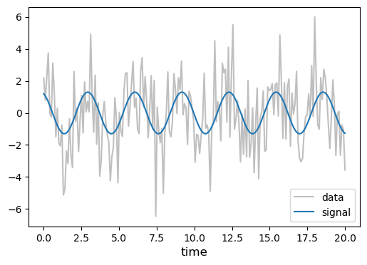
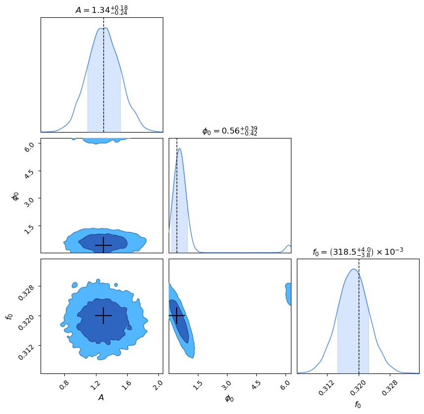
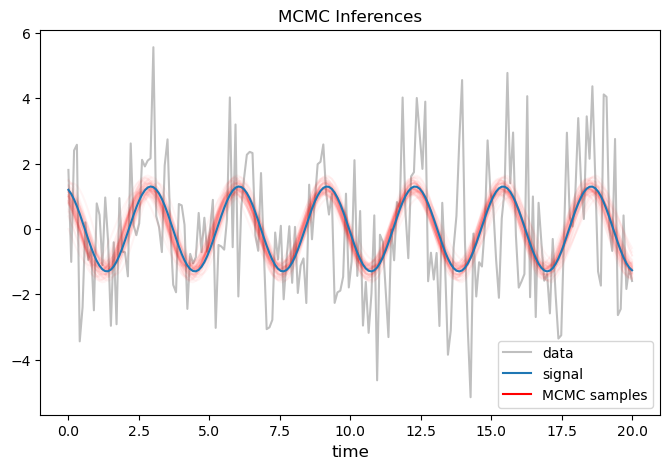

# MCMC: The Wave

Let's practice making an MCMC for a model that contains a **cyclic parameter**!

## Ingredients

Here are the ingredients that we are going to use in this MCMC:

````{tab-set}

```{tab-item} MCMC Techniques
- [x] standard MCMC
- [ ] parallel tempering
```

```{tab-item} Conveniences
- [x] progress tracking bar
- [x] efficiency tracking diagnostics
    - [x] in-model jump acceptance ratios
    - [ ] temperature swap acceptance ratios
- [x] cyclic parameters
```

```{tab-item} Jump Proposals
- [x] Gaussian/Multivariate Normal
- [ ] prior jumps
- [ ] multiple jump schemes
```

````

## The Wave

We will start with [The Wave problem](../toy_problems/toy_problems.md#the-wave).  We will copy/paste all of the same code we used before for [The Bump problem](../mcmc_the-bump/mcmc_the-bump.md#3d-bump), but [modify it appropriately](../cyclic_parameters.md) to handle the model's cyclic parameter!


```python
from tqdm import tqdm  # progress bar
import scipy.stats
import numpy as np
import matplotlib.pyplot as plt
from matplotlib.lines import Line2D
import pandas as pd
from chainconsumer import ChainConsumer, Chain, Truth
```

### Generate the Dataset

First we need to create a dataset that we will perform our Bayesian analysis on!  We will:
1. code a function for the wave model
2. create an array of observation times
3. create a signal
4. generate the underlying noise
5. create the observed dataset


```python
# Define The Wave Model as a function of the three parameters A, phi0, and f0
def Model(A, phi0, f0, t):
    return A*np.cos(phi0 + 2*np.pi*f0*t)
```


```python
# Generate the array of times at which we observe the data
starttime = 0
endtime   = 20
Tobs      = endtime - starttime

Nt        = 200  # number of timing data
times     = np.linspace(starttime, endtime, Nt)
```

```{attention}
In order to really demonstrate the success of our method for treating cyclic parameters, we are specifically going to choose a "true" value for $\phi_0$ very close to one of its natural periodic boundaries!  What we should then observe, is that the MCMC algorithm is able to efficiently cross back and forth over the periodic boundary as it searches, without getting stuck or running off and finding an infinite number of posterior modes!
```


```python
# Create the signal

# Inject the true value of the parameters we will try to recover!
injection = [1.3, 0.4, 0.32]

# calculate the signal from the model
signal    = Model(*injection, times)
```

For the sake of replicability, let us set a random seed when generating the noise:


```python
# Generate noise
# --> this dataset has uncorrelated white noise

# Setting a random seed so that you can replicate the graphs
rng_seed = np.random.default_rng(seed=42)

sigma_n = 2
noise   = rng_seed.normal(0, sigma_n, size=Nt)
```


```python
# Create the observed data
data = signal + noise
```

Let's take a quick look at what this data now looks like:


```python
fig, ax = plt.subplots(1,1,figsize=(6,4))

ax.plot(times, data,   color='gray', alpha=0.5, label='data')
ax.plot(times, signal, color='C0', label='signal')

ax.legend(), ax.set_xlabel('time', fontsize=12)
plt.show()
```


    

    


###  Prior and Likelihood

Next we need to write down our prior and (unnormalized) likelihood that we described in [The Wave](../toy_problems/toy_problems.md#the-wave).

```{attention}
As discussed in [Cyclic Parameters](../cyclic_parameters.md), we will define the boundaries for the cyclic parameter in our prior dictionary, and we will modify the prior function to appropriately wrap any input for the cyclic parameter around its appropriate interval.  The interval for $\phi_0$ here is $2\pi$, so for any input of this parameter into our function, we can use the modulo operator ('$\bmod$' or '$\%$'):

$\phi_0 = \phi_0 \bmod 2\pi$
```


```python
# Define a dictionary to store the prior for our parameter

prior = {
         'A':    scipy.stats.loguniform(a=1e-1, b=1e1),        #   a < x < b
         'phi0': scipy.stats.uniform(loc=0, scale=2*np.pi),    # loc < x < loc + scale
         'f0':   scipy.stats.loguniform(a=1e-1, b=1e1),        #   a < x < b
        }
```


```python
# Now use the dictionary to construct the log-prior function

def ln_prior(param):

    A, phi0, f0 = param

    # Cyclic Parameters
    phi0 %= (2*np.pi)

    # Calculate the PDF value of the input parameter
    prior_A    = prior['A'].pdf(A)
    prior_phi0 = prior['phi0'].pdf(phi0)
    prior_f0   = prior['f0'].pdf(f0)
    
    # !!Boundary check!!
    # If the parameters land out of their boundaries, let's automatically return an effective (numerical) -inf
    if (prior_A == 0) or (prior_phi0 == 0) or (prior_f0 == 0):
        return -1e300
    # Otherwise, return the log of the prior distribution
    else:
        return np.log(prior_A * prior_phi0 * prior_f0)
```

Ok, next we define the log-likelihood function:


```python
# Define the unnormalized log-likelihood function.

def ln_like(param, data, sigma_n, times):
    M = Model(*param, times)
    return (- (data - M)**2 / (2*sigma_n**2)).sum()
```

````{admonition} Sanity Check
:class: dropdown

Let's test the output of our prior and likelihood functions to make sure that they work the way we expect.


```python
print("Quick checks:")
print(r"--> log-prior of the injection              = {0:0.4f}".format(ln_prior(injection)))
print(r"--> log-prior out of cyclic parameter range = {0:0.4e}".format(ln_prior([1.9, 2*np.pi+0.1, 2.3])))
print(r"--> log-likelihood of the injection         = {0:0.4f}".format(ln_like(injection, data, sigma_n, times)))
```

    Quick checks:
    --> log-prior of the injection              = -4.0152
    --> log-prior out of cyclic parameter range = -6.3670e+00
    --> log-likelihood of the injection         = -77.4844


Ok everything seems fine, let's move on to defining our jump PDF!

````

### Jump Proposal

We have three model parameters, so let's just use just the basic [Multivariate Normal jump proposal](../building_jump_proposals.md#multivariate-normal-jumps).  Remember, this type of jump proposal is a [symmetric jump proposal](../building_jump_proposals.md#symmetric-jump-proposals), which means that the forward and reverse jumps will have equal probability.  So in practice, this means that the ratio of the reverse to the forward jump found in the acceptance ratio criteria {eq}`acceptance_ratio_code` will always be identically $=1$.

```{margin}
I have picked a jump Covariance matrix here that I found seemed to work decently well (through trial and error).
```


```python
# The FORWARD jump proposal

def jump_F_MultivariateNorm(sample_current):
    # Covariance matrix that set's each parameter's jump scale
    Cov = np.array([[0.1, 0,   0,    ],
                    [0,   0.1, 0,    ],
                    [0,   0,   0.0005]])
    
    # instantiate the probability density
    probability_density = scipy.stats.multivariate_normal(mean=np.array(sample_current), cov=Cov)

    # draw a new random sample using the .RVS() method, and calculate the PDF value using the .PDF() method
    sample_proposed = probability_density.rvs()
    pdf_value       = probability_density.pdf(sample_proposed)
    
    return sample_proposed, pdf_value


# The REVERSE jump proposal

def jump_R_MultivariateNorm(sample_current, sample_proposed):
    # standard deviation of the jump
    Cov = np.array([[0.1, 0,   0,    ],
                    [0,   0.1, 0,    ],
                    [0,   0,   0.0005]])
    
    # instantiate the probability density
    probability_density = scipy.stats.multivariate_normal(mean=np.array(sample_proposed), cov=Cov)

    # draw a new random sample using the .RVS() method, and calculate the PDF value using the .PDF() method    
    pdf_value = probability_density.pdf(sample_current)
    
    return pdf_value
```

````{admonition} Sanity Check
:class: dropdown

Let's test out our two new functions and verify that they are indeed symmetric!


```python
# Pick a starting parameter value
old_sample = [4.1, 3.783, 1.2]

# Propose a new parameter value + it's PDF value using the forward jump proposal
new_sample, PDF_forward = jump_F_MultivariateNorm(old_sample)

# Now calculate what the reverse PDF value would be if we jump from the proposed parameter back to the current parameter
PDF_reverse = jump_R_MultivariateNorm(old_sample, new_sample)

print("Current Sample  =", old_sample)
print("Proposed Sample =", new_sample)
print("PDF value of Proposed sample given Current  sample (FORWARD jump) = {0:0.4f}".format(PDF_forward))
print("PDF value of Current  sample given Proposed sample (REVERSE jump) = {0:0.4f}".format(PDF_reverse))
```

    Current Sample  = [4.1, 3.783, 1.2]
    Proposed Sample = [4.02029979 3.6358142  1.22438544]
    PDF value of Proposed sample given Current  sample (FORWARD jump) = 13.6194
    PDF value of Current  sample given Proposed sample (REVERSE jump) = 13.6194


````

### MCMC Algorithm

We will follow our [pseudo-code outline](../mcmc_basics.md#pseudo-code-for-the-mcmc-algorithm) and our [schematic](../schematics/schematics.md#mcmc).

```{attention}
[The last thing that we need to modify](../cyclic_parameters.md) for treating our cyclic parameter is to make sure that in the very final step of the algorithm, is to take any accepted proposed sample and modulo the parameter with its cyclic interval.  This will ensure that if the jump proposal proposed and accepted a jump to a cyclic parameter that lands outside of the prior boundary, the proposed sample is wrapped back into its periodic interval correctly!
```

We have also added in below our [dynamic counter](../tracking_in-model_jumps/tracking_in-model_jumps.md#dynamic-counter) for tracking the in-model acceptance rate!


```python
# data structure 
Nsample = 200_000   # number of samples
Ndim    = 3         # number of model dimensions

# Initialize data arrays
x_samples = np.zeros((Nsample, Ndim))

# Initialize random number generator for U draws
rng = np.random.default_rng()

# Initialize in-model jump tracking diagnostic (dynamic counter)
# --> store 0 (jump rejected) or 1 (jump accepted)
counter_jump_inmodel = np.zeros(Nsample-1)

# Starting sample
# --> (Pseudo-Code Step 1)
x_samples[0] =  [2.8, 4.7, 0.8]
```

```{margin}
Note that our model parameter $\phi_0$ in this problem is the $N_\text{dim}$ array indexed 1 here.  This is the reason for the '1' index in `x_samples[i,1] %= ...` below.
```


```python
# LOOP: Samples
for i in tqdm(range(1,Nsample), bar_format='{l_bar}{bar:30}{r_bar}'):

    # Current sample
    x_current = x_samples[i-1,:]

    # Propose NEW sample (and calculate it's FORWARD jump PDF)
    # --> (Pseudo-Code Steps 2, 3)
    x_proposed, jump_proposed = jump_F_MultivariateNorm(x_current)

    #-------------
    # Prior Check
    #-------------
    # If proposed sample is not allowed by prior, immediately reject the proposal (saves some computation)
    lnprior_proposed = ln_prior(x_proposed)
    
    if lnprior_proposed <= -1e300:
        # keep the current sample
        x_samples[i,:] = x_current
        
    #---------------------------
    # Acceptance Ratio Criteria
    #---------------------------
    # Calculate the log-prior, log-likelihood, and log-jump PDFs for the current and proposed samples
    # --> (Pseudo-Code Step 3)
    else:
        lnprior_current = ln_prior(x_current)
        
        lnlike_proposed = ln_like(x_proposed, data, sigma_n, times)
        lnlike_current  = ln_like(x_current,  data, sigma_n, times)

        lnjump_proposed = np.log( jump_proposed )
        lnjump_current  = np.log( jump_R_MultivariateNorm(x_current, x_proposed) )
    
        # Draw random number from Uniform Dist
        # --> (Pseudo-Code Step 4)
        U   = rng.uniform(0,1)
        lnU = np.log(U)

        # Heart of the MCMC Algorithm: the acceptance criteria
        # --> (Pseudo-Code Step 5)
        if (lnprior_proposed - lnprior_current) + (lnlike_proposed - lnlike_current) + (lnjump_current - lnjump_proposed) > lnU:
            # accept the proposed sample
            x_samples[i,:] = x_proposed
            # Cyclic Parameters
            x_samples[i,1] %= (2*np.pi)
            # update the in-model jump tracking diagnostic
            counter_jump_inmodel[i-1] = 1
        else:
            # keep the current sample
            x_samples[i,:] = x_current
```

    100%|██████████████████████████████| 199999/199999 [01:05<00:00, 3057.24it/s]


```python
# Calculate the in-model jump acceptance ratio (dynamic)
jump_acceptance_ratio_inmodel = np.cumsum(counter_jump_inmodel) / np.arange(1,Nsample,1)
```

### Result Plots

Now let's take a look at our results, to see how well our MCMC sampler worked!


```python
# Store the parameter labels and search ranges for reference in the plots below (just for convenience)
param_labels = [r'$A$', r'$\phi_0$', r'$f_0$']

param_ranges = {param_labels[0]: [prior['A'].a, prior['A'].b], 
                param_labels[1]: [prior['phi0'].support()[0], prior['phi0'].support()[1]], 
                param_labels[2]: [prior['f0'].a, prior['f0'].b]}
```


```python
#--------------
# Burn-in Plot
#--------------

fig, ax = plt.subplots(Ndim,1,figsize=(12,2*Ndim), sharex=True)
plt.subplots_adjust(hspace=0.1)

# Set-up axes to match priors
# --> scale the y-axis to the prior search scale
ax[0].set_yscale('log'), ax[2].set_yscale('log')
# --> grab the upper/lower limits for each prior
ax[0].set_ylim(param_ranges[param_labels[0]]), ax[1].set_ylim(param_ranges[param_labels[1]]), ax[2].set_ylim(param_ranges[param_labels[2]])

# Plot samples
for i in range(Ndim):
    ax[i].scatter(np.arange(0,Nsample,1), x_samples[:,i], s=0.5)
    
    # Plot injections
    ax[i].axhline(injection[i], color='k', linestyle='--')

    # y-axis labels
    ax[i].set_ylabel(param_labels[i], fontsize=12)

# Titles/Labels
ax[-1].set_xlabel('Iteration', fontsize=12)
ax[0].set_title('Burn-in')

plt.show()
```


    

    


```python
#-----------------------
# Jump Acceptance Ratio
#-----------------------

fig, ax = plt.subplots(1,1,figsize=(12,2), sharex=True)
ax.set_ylim([0,1])

ax.scatter(np.arange(1,Nsample,1), jump_acceptance_ratio_inmodel, s=0.5)
ax.text(0.86, 0.82, 'Average = {0:0.2f}'.format(jump_acceptance_ratio_inmodel.mean()), transform=ax.transAxes, bbox=dict(color='white',ec='k'));

# Titles/Labels
ax.set_xlabel('Iteration', fontsize=12), ax.set_ylabel('In-Model Jump\nAcceptance Ratio', fontsize=12)
ax.set_title('Tracking Diagnostics')
ax.grid()

plt.show()
```


    

    


Now that we have an idea of how long it took our sampler to burn-in, let's throw away the initial samples and make a histogram of our final posterior from the remaining samples!


```python
# Discard (burn) samples
burn = 25_000

# Final posterior samples
# --> we will save two copies of the final samples: 
#     (1) one as a Pandas DataFrame (specifically for the Chainconsumer plot below),
#     (2) and the other as a regular array structure

# Pandas data stucture
PD_samples_final = pd.DataFrame(data    = x_samples[burn:],  # discard the burn-in samples
                                columns = param_labels,
                                )
# Regular array structure
x_samples_final = np.asarray(PD_samples_final)
```

Create the final corner plot of the posterior samples.

```{margin}
Note, rather than show the full parameter search range in the corner plot here, I'm just using the defaults.  This is mainly because the frequency (and amplitude) parameters are so well measured that plotting the full range does not look good visually.
```


```python
#-------------
# Corner Plot
#-------------

c = ChainConsumer()

chain = Chain(samples = PD_samples_final,
              columns = param_labels,
              name    = "MCMC: The Wave",
              )

c.add_chain(chain)

# Plot injections
c.add_truth(Truth(location=dict(zip(param_labels, np.asarray(injection))), color='k', marker='+', marker_size='600'))

c.plotter.plot();
```


    

    


Let's also look examples of the MCMC inferences.


```python
#-----------------
# Inferences Plot
#-----------------

fig, ax = plt.subplots(1,1,figsize=(8,5))

# plot the data
ax.plot(times, data, color='gray', alpha=0.5, label='data')

# Randomly select a subset of parameter samples
nselect = 50
indices = np.random.randint(len(x_samples_final), size=nselect)
# Now feed those parameters back into the model and see how they look plotted on our data
for ind in indices:
    model = Model(*x_samples_final[ind,:], times)
    ax.plot(times, model, color='r', alpha=2/nselect)

# plot the signal
ax.plot(times, signal, color='C0', label='signal')

# Titles/Labels
ax.set_title('MCMC Inferences')

# --> manually add the 'MCMC inferences' line to the legend
handles, labels = ax.get_legend_handles_labels()
line = Line2D([0], [0], label='MCMC samples', color='r')
handles.extend([line])

ax.legend(handles=handles), ax.set_xlabel('time', fontsize=12)

plt.show()
```


    

    


I think these plots show our sampler did pretty good!  The burn-in plot specifically really gives us an idea of how well our modifications allowed the algorithm to handle the cyclic $\phi_0$ parameter!  Since we intentionally injected the true value of $\phi_0$ close to one of the boundaries, we see that the MCMC algorithm was able to easily propose and make jumps that crossed the periodic boundary.
