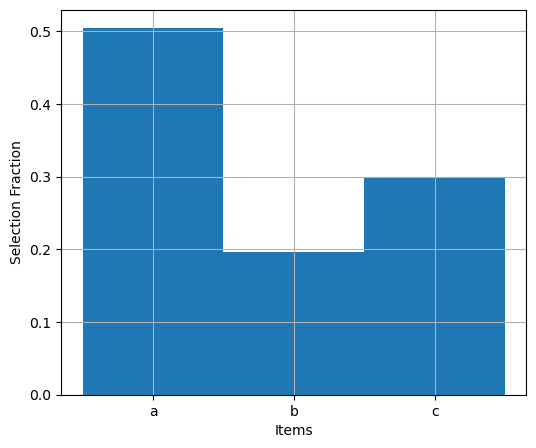

# Multiple Jump Schemes

```{margin}
If you are curious to see a real-world example of this, {cite:t}`CorbinCornish_2010` describe in their Section 3.3 of their work how they built a (parallel tempered) MCMC sampler that employed, "A combination of six proposal distributions."
```
Most well built MCMC algorithms for more complicated problems likely use a combination or "cocktail" of multiple different jump proposals, all working to try and improve the efficiency and ability of the sampler to effectively explore the parameter space and determine the underlying posterior distribution.  So far we have built our MCMC algorithm with only a single type of jump PDF.

As we alluded to in [Building Jump Proposal Distributions](../building_jump_proposals.md), the way we have constructed our forward and reverse jump functions so far was with a bit of 'future-proofing' in mind.  Future-proofing that is now about to pay off and make it really easy for us to implement multiple jump schemes that work together!

## Selection Tool

Typically what we are going to want to be able to do is say something like, "I want my MCMC sampler to use a Multivariate Normal jump proposal 70% of the time, and a prior jump proposal the remaining 30% of the time."  But in essense, every time the MCMC sampler makes an [in-model move](../schematics/schematics.md), I want *it* to randomly select from my prescribed cocktail of jump proposals with their prescribed selection rates.

To achieve this, let's make ourselves a little **selection tool**, a function that takes as inputs a list of items and a list of rates, then randomly outputs one of the items in the list at the prescribed rate.

```{seealso}
I want to give a major shout-out to *stack **overflow*** user 'job' for [their suggested solution to the problem posted here](https://stackoverflow.com/questions/1556232/how-to-select-an-item-from-a-list-with-known-percentages-in-python)!  When I was trying to figure out how to implement multiple jump schemes in my sampler, I came across this question and answer, and the little snippet of code in the answer was exactly the thing I needed!  It's a very clever little piece of code (I think).
```


```python
import numpy as np
import matplotlib.pyplot as plt
```


```python
# Create a 'selection tool'

def choose(items, rates):
    # start with the first rate in the list
    list_rate = rates[0]
    # draw a random number between [0, 1)
    r = np.random.random()
    
    # LOOP: while the random number is greater than the first rate in the list
    i = 0
    while r > list_rate :
        i += 1
        list_rate += rates[i]
    return items[i]
```

So if the first random number is less than the first item's rate, the function returns the first item.  If the first random number is greater than the first item's rate, then we get the cummulative total of the first two rates and check if the random number is still greater than that.  If it is not, then the function returns the second item, otherwise the loop continues.


### Example

Let's test it on an example and see how it works!  In this example we are going to pass the function a list of letters, and each letter will is given a different selection rate.  In order to see if the function really is outputting the letters at their prescribed rates, we randomly draw a large number of items using the selection tool, and make a histogram of the results!


```python
# Number of random selections to make
N = 100_000
selections = np.zeros(N)

# Specify the list and their rates
# NOTE: rates should sum to 1!
items = ['a', 'b', 'c']
rates = [0.5, 0.2, 0.3]
```


```python
for i in range(N):
    pick = choose(items, rates)
    if pick == 'a':
        selections[i] = 0
    if pick == 'b':
        selections[i] = 1
    if pick == 'c':
        selections[i] = 2
```


```python
fig, ax = plt.subplots(1,1,figsize=(6,5))

ax.hist(selections, bins=[0,1,2,3], density=True);
ax.set_xticks([0.5, 1.5, 2.5]), ax.set_xticklabels(items)

ax.set_ylabel("Selection Fraction"), ax.set_xlabel("Items")
ax.grid()
```


    

    


```{important}
Just remember, the fractional rates for the items in our list should sum up to 1.  Otherwise the `choose` function will not work properly.
```

## Implementation

Now that we have a selection tool, we can implement it into our MCMC algorithm to first choose a jump proposal from a list of jump proposals.  Once we have the jump proposal, then we can generate a new proposed sample, and calculate the value of the jump PDF at that proposed sample.

This is where we can now benefit from making sure we write our jump proposals functions (the forward and reverse jumps) in the same identical manner, so that swapping different jump functions in and out works seemlessly!


````{admonition} Implementing Multiple Jump Schemes
In order to implement multiple jump schemes in our MCMC algorithm, we will:

1. Copy/paste the above code for the [`choose` function](#selection-tool).

2. Define each of the [forward/reverse jump functions that we wish to implement](../building_jump_proposals.md), using the same common format that looks something like:

```
def jump_F_<name>(sample_current):
    ...
    return sample_proposed, pdf

def jump_R_<name>(sample_current, sample_proposed):
    ...
    return pdf
```

3. Create a list of the jump `jump_scheme` 'items' and the `jump_scheme_rates` fractional 'rates' at which we wish them to be used through the algorithm.  That will look something like:

```
jump_schemes      = [[jump_F_MultivariateNorm, jump_R_MultivariateNorm], 
                     [jump_F_prior,            jump_R_prior   ]]

jump_scheme_rates = [0.7,
                     0.3]
```

4.  Inside of the main MCMC loop, use the new `choose` function to randomly select a set of forward/reverse jump functions, then use them as before to calculate the necessary quantities.  This will look something like:

```
# Choose a Jump scheme
jump_forward, jump_reverse = choose(jump_schemes, jump_scheme_rates)

# Draw a new proposed sample
x_proposed, jump_proposed = jump_forward(x_current)

...

    #---------------------------
    # Acceptance Ratio Criteria
    #---------------------------
    else:

        lnjump_proposed = np.log( jump_proposed )
        lnjump_current  = np.log( jump_reverse(x_current, x_proposed) )

        ...
```

````
