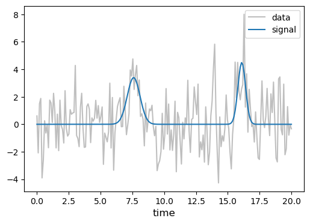
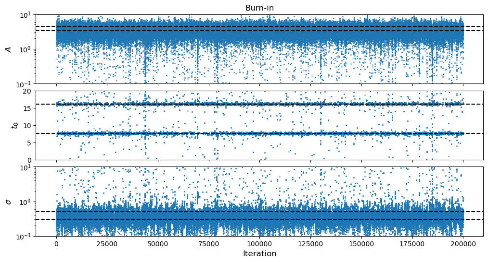
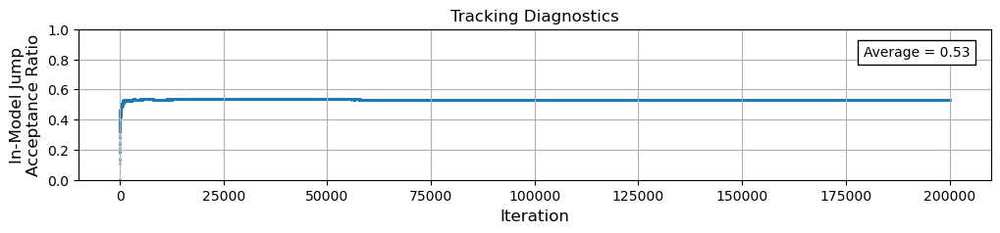
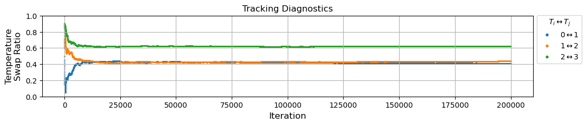
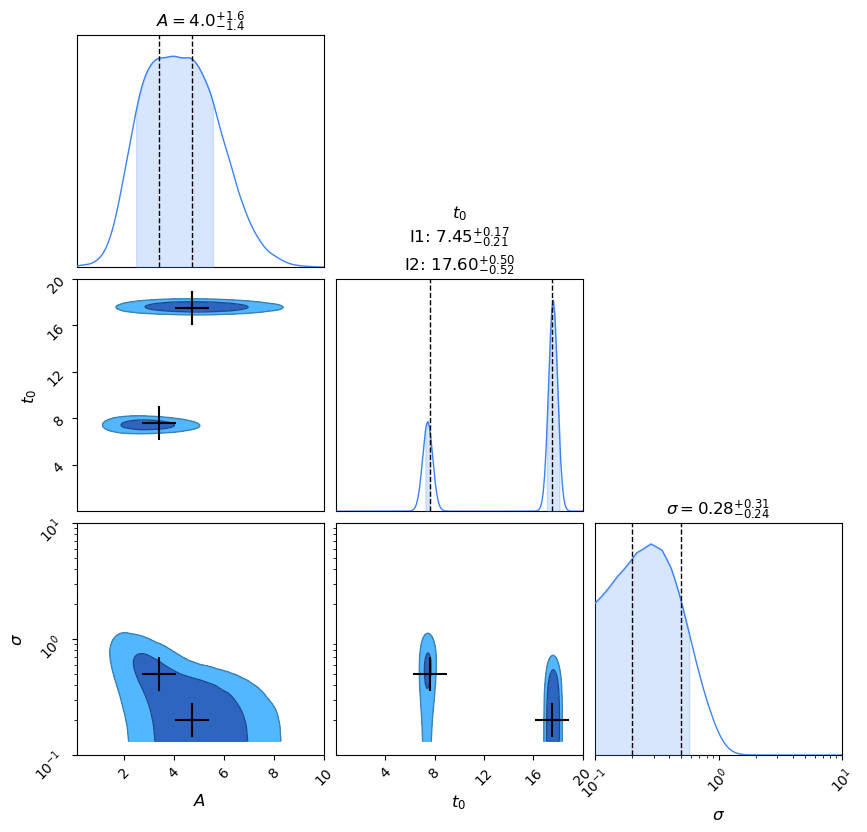
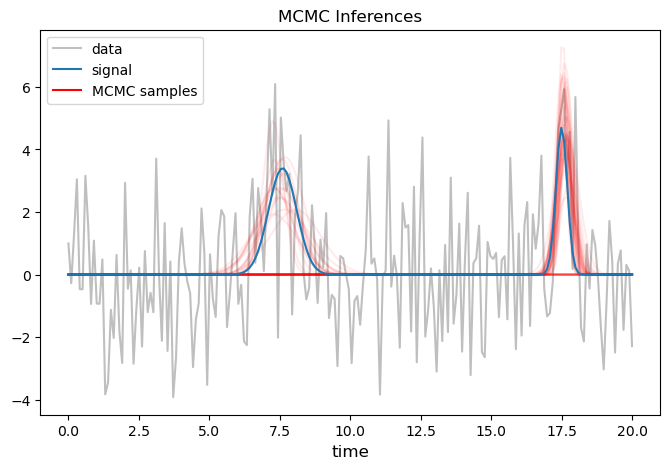

# PTMCMC: Multi-Bump

Let's revisit our ["Multi-Bump" problem](../mcmc_multi-bump/mcmc_multi-bump.md), but this time we will implement our first **parallel tempered** MCMC algorithm!

## Ingredients

Here are the ingredients that we are going to use in this MCMC:

````{tab-set}

```{tab-item} MCMC Techniques
- [ ] standard MCMC
- [x] parallel tempering
- [ ] rejection sampling
```

```{tab-item} Conveniences
- [x] progress tracking bar
- [x] efficiency tracking diagnostics
    - [x] in-model jump acceptance ratios
    - [x] temperature swap acceptance ratios
- [ ] cyclic parameters
```

```{tab-item} Jump Proposals
- [x] symmetric jumps
    - [x] Gaussian/Multivariate Normal
- [x] prior jumps
- [ ] block (gibbs) jumps
- [x] multiple jump schemes
```

````

## Multi-Bump

In theory, it can be helpful to employ PTMCMCs on multi-modal problems like this one.  At higher temperatures, the parallel tempering should help flatten the modes and allow the sampler to more efficiently explore the parameter space.  Let's see what happens when we use it on this problem! 

```{attention}
For what follows, we will effectively copy/paste all of the code we wrote for our [Multi-Bump problem](../mcmc_multi-bump/mcmc_multi-bump.md) and use it again as our starting point!  But we will be modifying the MCMC algorithm itself to include parallel tempering.
```


```python
from tqdm import tqdm  # progress bar
import scipy.stats
import numpy as np
import matplotlib.pyplot as plt
from matplotlib.lines import Line2D
import pandas as pd
from chainconsumer import ChainConsumer, Chain, Truth, PlotConfig
```

### Generate the Dataset

First we need to create a dataset that we will perform our Bayesian analysis on!  We will:
1. code a function for the bump model
2. create an array of observation times
3. create a signal
4. generate the underlying noise
5. create the observed dataset


```python
# Define The Bump Model as a function of the three parameters A, t0, and sigma
def Model(A, t0, sigma, t):
    return A*np.exp(-(t-t0)**2/(2*sigma**2))
```


```python
# Generate the array of times at which we observe the data
starttime = 0
endtime   = 20
Tobs      = endtime - starttime

Nt        = 200  # number of timing data
times     = np.linspace(starttime, endtime, Nt)
```


```python
# Create the signal

# Inject the true value of the parameters we will try to recover!
injection = [[3.4, 7.6, 0.5],
             [4.7, 17.5, 0.2]]

signal = np.zeros_like(times)
for inj in injection:
    signal += Model(*inj, times)
```

For the sake of replicability, let us set a random seed when generating the noise:


```python
# Generate noise
# --> this dataset has uncorrelated white noise

# Setting a random seed so that you can replicate the graphs
np.random.seed(42)

sigma_n = 2
noise   = np.random.normal(0, sigma_n, size=Nt)
```


```python
# Create the observed data
data = signal + noise
```

Let's take a quick look at what this data now looks like:


```python
fig, ax = plt.subplots(1,1,figsize=(6,4))

ax.plot(times, data,   color='gray', alpha=0.5, label='data')
ax.plot(times, signal, color='C0', label='signal')

ax.legend(), ax.set_xlabel('time', fontsize=12)
plt.show()
```


    

    


###  Prior and Likelihood

Next we need to write down our prior and likelihood that we described in [The Bump](../toy_problems/toy_problems.md#the-bump).

With regards to the likelihood,
> **we still don't need to worry about including the normalization in our definition of the likelihood function here, for the reason we explained above in the 1D problem.**


```python
# Define a dictionary to store the prior for our parameter

prior = {
         'A':     scipy.stats.loguniform(a=1e-1, b=1e1),             #   a < x < b
         't0':    scipy.stats.uniform(loc=starttime, scale=Tobs),    # loc < x < loc + scale
         'sigma': scipy.stats.loguniform(a=1e-1, b=1e1),             #   a < x < b
        }
```


```python
# Now use the dictionary to construct the log-prior function

def ln_prior(param):

    A, t0, sigma = param

    # Calculate the PDF value of the input parameter
    prior_A     = prior['A'].pdf(A)
    prior_t0    = prior['t0'].pdf(t0)
    prior_sigma = prior['sigma'].pdf(sigma)

    # !!Boundary check!!
    # If the parameters land out of their boundaries, let's automatically return an effective (numerical) -inf
    if (prior_A == 0) or (prior_t0 == 0) or (prior_sigma == 0):
        return -1e300
    # Otherwise, return the log of the prior distribution
    else:
        return np.log(prior_A * prior_t0 * prior_sigma)
```

Ok, next we define the log-likelihood function:


```python
# Define the unnormalized log-likelihood function.

def ln_like(param, data, sigma_n, times):
    M = Model(*param, times)
    return (- (data - M)**2 / (2*sigma_n**2)).sum()
```

**Sanity Check:** Let's test the output of our prior and likelihood functions to make sure that they work the way we expect:


```python
print("Quick checks:")
print(r"--> log-prior of injection 1      = {0:0.4f}".format(ln_prior(injection[0])))
print(r"--> log-prior of injection 2      = {0:0.4f}".format(ln_prior(injection[1])))
print(r"--> log-prior out of prior range  = {0:0.4e}".format(ln_prior([1.78, endtime+0.0001, 4.03])))
print(r"--> log-likelihood of injection 1 = {0:0.4f}".format(ln_like(injection[0], data, sigma_n, times)))
print(r"--> log-likelihood of injection 2 = {0:0.4f}".format(ln_like(injection[1], data, sigma_n, times)))
```

    Quick checks:
    --> log-prior of injection 1      = -6.5807
    --> log-prior of injection 2      = -5.9882
    --> log-prior out of prior range  = -1.0000e+300
    --> log-likelihood of injection 1 = -99.7395
    --> log-likelihood of injection 2 = -98.6449


Ok everything seems fine, let's move on to defining our jump PDF!

### Jump Proposal

Let's define what we want in our cocktail jump proposals!

```{margin}
I have picked a jump Covariance matrix here that I found seemed to work decently well (through trial and error).
```


```python
# The FORWARD jump proposal

def jump_F_MultivariateNorm(sample_current):
    # Covariance matrix that set's each parameter's jump scale
    Cov = np.array([[1, 0,    0   ],
                    [0, 1e-3, 0   ],
                    [0, 0,    1e-3]])
    
    # draw a new random sample using the .RVS() method, and calculate the PDF value using the .PDF() method
    sample_proposed = scipy.stats.multivariate_normal(mean=np.array(sample_current), cov=Cov).rvs()
    pdf_value       = scipy.stats.multivariate_normal(mean=np.array(sample_current), cov=Cov).pdf(sample_proposed)
    
    return sample_proposed, pdf_value


# The REVERSE jump proposal

def jump_R_MultivariateNorm(sample_current, sample_proposed):
    # Covariance matrix that set's each parameter's jump scale
    Cov = np.array([[1, 0,    0   ],
                    [0, 1e-3, 0   ],
                    [0, 0,    1e-3]])
    
    # draw a new random sample using the .RVS() method, and calculate the PDF value using the .PDF() method    
    pdf_value = scipy.stats.multivariate_normal(mean=np.array(sample_proposed), cov=Cov).pdf(sample_current)
    
    return pdf_value
```

**Sanity Check:** Let's test out our two new functions and verify that they are indeed symmetric!


```python
# Pick a starting parameter value
old_sample = [4.1, 3.7, 1.2]

# Propose a new parameter value + it's PDF value using the forward jump proposal
new_sample, PDF_forward = jump_F_MultivariateNorm(old_sample)

# Now calculate what the reverse PDF value would be if we jump from the proposed parameter back to the current parameter
PDF_reverse = jump_R_MultivariateNorm(old_sample, new_sample)

print("Current Sample  =", old_sample)
print("Proposed Sample =", new_sample)
print("PDF value of Proposed sample given Current  sample (FORWARD jump) = {0:0.4f}".format(PDF_forward))
print("PDF value of Current  sample given Proposed sample (REVERSE jump) = {0:0.4f}".format(PDF_reverse))
```

    Current Sample  = [4.1, 3.7, 1.2]
    Proposed Sample = [4.45778736 3.73424909 1.21773356]
    PDF value of Proposed sample given Current  sample (FORWARD jump) = 28.3094
    PDF value of Current  sample given Proposed sample (REVERSE jump) = 28.3094


```python
# The FORWARD jump proposal

def jump_F_prior(sample_current):
    # draw a new random sample using the .RVS() method, and calculate the PDF value using the .PDF() method
    # NOTE: no actual functional dependence on sample_current!
    sample_proposed = np.array([prior['A'].rvs(), prior['t0'].rvs(), prior['sigma'].rvs()])
    pdf_value       = prior['A'].pdf(sample_proposed[0]) * prior['t0'].pdf(sample_proposed[1]) * prior['sigma'].pdf(sample_proposed[2])
    
    return sample_proposed, pdf_value


# The REVERSE jump proposal

def jump_R_prior(sample_current, sample_proposed):
    # draw a new random sample using the .RVS() method, and calculate the PDF value using the .PDF() method    
    # NOTE: no actual functional dependence on sample_proposed!
    pdf_value = prior['A'].pdf(sample_current[0]) * prior['t0'].pdf(sample_current[1]) * prior['sigma'].pdf(sample_current[2])
    
    return pdf_value
```

**Sanity Check:** Let's test out our two new functions.  They should be *non*-symmetric.


```python
# Pick a starting parameter value
old_sample = [4.1, 3.7, 1.2]

# Propose a new parameter value + it's PDF value using the forward jump proposal
new_sample, PDF_forward = jump_F_prior(old_sample)

# Now calculate what the reverse PDF value would be if we jump from the proposed parameter back to the current parameter
PDF_reverse = jump_R_prior(old_sample, new_sample)

print("Current Sample  =", old_sample)
print("Proposed Sample =", new_sample)
print("PDF value of Proposed sample given Current  sample (FORWARD jump) = {0:0.4f}".format(PDF_forward))
print("PDF value of Current  sample given Proposed sample (REVERSE jump) = {0:0.4f}".format(PDF_reverse))
```

    Current Sample  = [4.1, 3.7, 1.2]
    Proposed Sample = [0.5235791  5.87183689 4.15644761]
    PDF value of Proposed sample given Current  sample (FORWARD jump) = 0.0011
    PDF value of Current  sample given Proposed sample (REVERSE jump) = 0.0005


```python
# Create a 'selection tool'

def choose(items, rates):
    # start with the first rate in the list
    list_rate = rates[0]
    # draw a random number between [0, 1)
    r = np.random.random()
    
    # LOOP: while the random number is greater than the first rate in the list
    i = 0
    while r > list_rate :
        i += 1
        list_rate += rates[i]
    return items[i]
```


```python
jump_schemes      = [[jump_F_MultivariateNorm, jump_R_MultivariateNorm], 
                     [jump_F_prior,            jump_R_prior   ]]

jump_scheme_rates = [0.9,
                     0.1]
```

### MCMC Algorithm

Ok now we are going to build a PTMCMC sampler!  We will follow our new [pseudo-code outline](../ptmcmc_basics.md#pseudo-code-for-the-ptmcmc-algorithm) and our [PTMCMC schematic](../schematics/schematics.md#parallel-tempered-mcmc-ptmcmc).

First we are going to create a **temperature ladder**.  This is just the list of temperatures that each of our tempered MCMCs are going to run at.  

```{attention}
Don't forget, the first (or zeroth indexed) temperature must always be identically $T_0 = 1$!  This gives us our original likelihood and hence our original posterior.  All of the hotter temperatures are up to the user to decide (both how many, and what temperatures).  The max temperature is $T_\text{max} = \infty$, which completely flattens the likelihood and results in a sampler that is *only* exploring the prior PDF.
```


```python
# Temperature Ladder: select the temperatures for each copy of the MCMC.
# --> (PT Pseudo-Code Step 1)
temp_ladder = [1, 1.8, 3, 8]
Ntemp       = len(temp_ladder)
```

In this example, we are also going to add a [**dynamic** temperature swap acceptance tracker](../tracking_temp_swap_ratios/tracking_temp_swap_ratios.md#dynamic-counter), so that we can better diagnose how efficiently our sampler is swapping temperatures.  And we'll modify the counter for the in-model jumps so that we can also track those across all of the parallel MCMCs (also dynamically).


```python
# data structure 
Nsample = 200_000   # number of samples
Ndim    = 3         # number of model dimensions

# Initialize data arrays
x_samples = np.zeros((Nsample, Ntemp, Ndim))

# Initialize tracking diagnostics (dynamic counters)
counter_jump_inmodel = np.zeros((Nsample-1,Ntemp))
counter_temp_swap    = np.full((Nsample-1,Ntemp-1), np.nan)

# Starting sample
# --> (MCMC Pseudo-Code Step 1)
x_samples[0] = np.array([prior['A'].rvs(), prior['t0'].rvs(), prior['sigma'].rvs()])
```

````{margin}
The way I select which adjacent temperatures are selected for a temperature swap is like the [PTMCMC schematic](../schematics/schematics.md#parallel-tempered-mcmc-ptmcmc) is trying to show.  You can see this more easily if you note that:

```python
Ntemp = 4

for i in range(1,10):
    index1 = (i-1) % (Ntemp-1)
    index2 = (i-1) % (Ntemp-1) + 1

    print(index1,index2)
```

    0 1
    1 2
    2 3
    0 1
    1 2
    2 3
    0 1
    1 2
    2 3

````


```python
# LOOP: Samples
for i in tqdm(range(1,Nsample)):

    # LOOP: Temperatures --------------------------------------------------------------------------------------------------------------
    # --> (PT Pseudo-Code Step 2)
    for j in range(0,Ntemp):

        # Select the temperature
        T = temp_ladder[j]
        
        # Current sample
        x_current = x_samples[i-1,j,:]
        
        # Choose a Jump scheme
        jump_forward, jump_reverse = choose(jump_schemes, jump_scheme_rates)
        
        # Propose NEW sample (and calculate it's FORWARD jump PDF)
        # --> (MCMC Pseudo-Code Steps 2, 3)
        x_proposed, jump_proposed = jump_forward(x_current)
    
        #-------------
        # Prior Check
        #-------------
        # If proposed sample is not allowed by prior, immediately reject the proposal (saves some computation)
        lnprior_proposed = ln_prior(x_proposed)
        
        if lnprior_proposed <= -1e300:
            # keep the current sample
            x_samples[i,j,:] = x_current
            
        #---------------------------
        # Acceptance Ratio Criteria
        #---------------------------
        # Calculate the log-prior, log-likelihood, and log-jump PDFs for the current and proposed samples
        # --> (MCMC Pseudo-Code Step 3)
        else:
            lnprior_current = ln_prior(x_current)

            lnlike_proposed = ln_like(x_proposed, data, sigma_n, times)
            lnlike_current  = ln_like(x_current,  data, sigma_n, times)
    
            lnjump_proposed = np.log( jump_proposed )
            lnjump_current  = np.log( jump_reverse(x_current, x_proposed) )
            
            # Draw random number from Uniform Dist
            # --> (MCMC Pseudo-Code Step 4)
            U   = np.random.uniform(0,1)
            lnU = np.log(U)
    
            # Heart of the MCMC Algorithm: the acceptance criteria
            # --> (MCMC Pseudo-Code Step 5)
            # --> (PT Pseudo-Code Step 1)
            if (lnprior_proposed - lnprior_current) + (lnlike_proposed - lnlike_current)/T + (lnjump_current - lnjump_proposed) > lnU:
                # accept the proposed sample
                x_samples[i,j,:] = x_proposed
                # update the in-model jump tracking diagnostic
                counter_jump_inmodel[i-1,j] = 1   
            else:
                # keep the current sample
                x_samples[i,j,:] = x_current
    #----------------------------------------------------------------------------------------------------------------------------------
    # Temperature Acceptance Ratio Criteria
    #---------------------------------------
    
    # Draw random number from Uniform Dist
    # --> (PT Pseudo-Code Step 3)
    U   = np.random.uniform(0,1)
    lnU = np.log(U)

    # Select two temperatures and their samples to propose to swap (cycle through these at each iteration)
    # --> (PT Pseudo-Code Step 4)
    index1 = (i-1) % (Ntemp-1)
    index2 = (i-1) % (Ntemp-1) + 1
    
    T1 = temp_ladder[index1]
    T2 = temp_ladder[index2]

    # --> NOTE: it is important to make copies of the samples and temporarily save them!
    x_current1 = np.copy(x_samples[i,index1,:])
    x_current2 = np.copy(x_samples[i,index2,:])

    # Calculate the log-likelihood PDFs for the current samples for each temperature
    lnlike_1 = ln_like(x_current1, data, sigma_n, times)
    lnlike_2 = ln_like(x_current2, data, sigma_n, times)

    # Heart of the Parallel Tempering Algorithm: the temperature acceptance criteria
    # --> (PT Pseudo-Code Step 5)
    if (1/T2 - 1/T1) * (lnlike_1 - lnlike_2) > lnU:
        # accept the proposed temperature swap
        x_samples[i,index2,:] = x_current1
        x_samples[i,index1,:] = x_current2
        # update the temperature swap tracking diagnostic
        counter_temp_swap[i-1,index1] = 1
    else:
        # update the temperature swap tracking diagnostic
        counter_temp_swap[i-1,index1] = 0
```

    100%|████████████████████████████████████████████████████████████████████████████████████████████████████████████| 199999/199999 [05:02<00:00, 661.52it/s]


```{margin}
Here we calculate the in-model jump acceptance ratios for each parallel MCMC, and their temperature swap ratios.
```


```python
# Calculate the in-model jump acceptance ratio (dynamic)
jump_acceptance_ratio_inmodel = np.cumsum(counter_jump_inmodel, axis=0) / np.arange(1,Nsample,1).reshape(-1,1)

jump_temperature_swap_ratio = ( np.ma.masked_array(counter_temp_swap, mask=np.isnan(counter_temp_swap)).cumsum(axis=0).filled(np.nan) 
                                / np.hstack([np.ones(Ntemp-1)*n for n in range(1,int(np.ceil((Nsample-1)/(Ntemp-1)+1)))])[:Nsample-1].reshape(-1,1) )
```

### Result Plots

Now let's take a look at our results, to see how well our new PTMCMC sampler worked!


```python
# Store the parameter labels and search ranges for reference in the plots below (just for convenience)
param_labels = [r'$A$', r'$t_0$', r'$\sigma$']

param_ranges = {param_labels[0]: [prior['A'].a, prior['A'].b], 
                param_labels[1]: [prior['t0'].support()[0], prior['t0'].support()[1]], 
                param_labels[2]: [prior['sigma'].a, prior['sigma'].b]}
```

```{tip}
I often like to define the following `which_temp` selector before I make my plots.  At the end of the day, with parallel tempering the zeroth indexed (i.e. $T_0 = 1$) temperature is all that matters since it *is* our original posterior, but sometimes I like to look at all of the different plots but for the other higher temperatures.  This is another way we can diagnose and check that the results we are getting make sense, and are behaving as we would expect (and also to help us build our intuition for the sampler and the results!).

So try copying this code and re-run the plots for each of the temperatures, and pay attention to how they change as you do so.  You should see that as the temperatures get higher, the sampler is able to cover more of the prior volume, and that the effect of the likelihood becomes less noticeable (remember for $T = \infty$, the sampler should *only* be sampling the prior!).
```


```python
# Select which temperature to use for the plots below
# --> Index 0 represents the true posterior
which_temp = 0
```


```python
#--------------
# Burn-in Plot
#--------------

fig, ax = plt.subplots(Ndim,1,figsize=(12,2*Ndim), sharex=True)
plt.subplots_adjust(hspace=0.1)

# Set-up axes to match priors
# --> scale the y-axis to the prior search scale
ax[0].set_yscale('log'), ax[2].set_yscale('log')
# --> grab the upper/lower limits for each prior
ax[0].set_ylim(param_ranges[param_labels[0]]), ax[1].set_ylim(param_ranges[param_labels[1]]), ax[2].set_ylim(param_ranges[param_labels[2]])

# Plot samples
for i in range(Ndim):
    ax[i].scatter(np.arange(0,Nsample,1), x_samples[:,which_temp,i], s=0.5)
    
    # Plot injections
    for inj in injection:
        ax[i].axhline(inj[i], color='k', linestyle='--')

    # y-axis labels
    ax[i].set_ylabel(param_labels[i], fontsize=12)

# Titles/Labels
ax[-1].set_xlabel('Iteration', fontsize=12)
ax[0].set_title('Burn-in')

plt.show()
```


    

    


```python
#-----------------------
# Jump Acceptance Ratio
#-----------------------

fig, ax = plt.subplots(1,1,figsize=(12,2), sharex=True)
ax.set_ylim([0,1])

ax.scatter(np.arange(1,Nsample,1), jump_acceptance_ratio_inmodel[:,which_temp], s=0.5)
ax.text(0.86, 0.82, 'Average = {0:0.2f}'.format(jump_acceptance_ratio_inmodel[:,which_temp].mean()), transform=ax.transAxes, bbox=dict(color='white',ec='k'));

# Titles/Labels
ax.set_xlabel('Iteration', fontsize=12), ax.set_ylabel('In-Model Jump\nAcceptance Ratio', fontsize=12)
ax.set_title('Tracking Diagnostics')
ax.grid()

plt.show()
```


    

    


```python
#------------------------
# Temperature Swap Ratio
#------------------------

fig, ax = plt.subplots(1,1,figsize=(12,2), sharex=True)
ax.set_ylim([0,1])

for j in range(0,Ntemp-1):
    ax.scatter(np.arange(1,Nsample,1), jump_temperature_swap_ratio[:,j], s=0.5)

# Titles/Labels
ax.set_xlabel('Iteration', fontsize=12), ax.set_ylabel('Temperature\nSwap Ratio', fontsize=12)
ax.set_title('Tracking Diagnostics')
ax.grid()

# --> manually add the markers to the legend
handles, labels = ax.get_legend_handles_labels()
point = []
for j in range(0,Ntemp-1):
    point += [Line2D([0], [0], label=r'{0:0.0f}$\leftrightarrow${1:0.0f}'.format(j,j+1), marker='.', markerfacecolor=f'C{j}', markeredgecolor=f'C{j}', linestyle='')]
handles.extend(point)

ax.legend(handles=handles, title=r'$T_i \leftrightarrow T_j$', loc='upper left', bbox_to_anchor=(1, 1.05))

plt.show()
```


    

    


Now that we have an idea of how long it took our sampler to burn-in, let's throw away the initial samples and make a histogram of our final posterior from the remaining samples!


```python
# Discard (burn) samples
burn = 20_000

# Final posterior samples
# --> we will save two copies of the final samples: 
#     (1) one as a Pandas DataFrame (specifically for the Chainconsumer plot below),
#     (2) and the other as a regular array structure

# Pandas data stucture
PD_samples_final = pd.DataFrame(data    = x_samples[burn:,which_temp],  # discard the burn-in samples
                                columns = param_labels,
                                )
# Regular array structure
x_samples_final = np.asarray(PD_samples_final)
```

Create the final corner plot of the posterior samples.


```python
#-------------
# Corner Plot
#-------------

c = ChainConsumer()

chain = Chain(samples    = PD_samples_final,
              columns    = param_labels,
              name       = "PTMCMC: Multi-Bump",
              multimodal = True,
              )

c.add_chain(chain)

# Plot injections
for inj in injection:
    c.add_truth(Truth(location=dict(zip(param_labels, np.asarray(inj))), color='k', marker='+', marker_size='600'))

# Set parameter ranges/scales
param_logscales = [param_labels[2]]
c.set_plot_config(PlotConfig(log_scales=param_logscales, extents=param_ranges))

c.plotter.plot();
```


    

    


Let's also look examples of the MCMC inferences.


```python
#-----------------
# Inferences Plot
#-----------------

fig, ax = plt.subplots(1,1,figsize=(8,5))

# plot the data
ax.plot(times, data, color='gray', alpha=0.5, label='data')

# Randomly select a subset of parameter samples
nselect = 50
indices = np.random.randint(len(x_samples_final), size=nselect)
# Now feed those parameters back into the model and see how they look plotted on our data
for ind in indices:
    model = Model(*x_samples_final[ind,:], times)
    ax.plot(times, model, color='r', alpha=4/nselect)

# plot the signal
ax.plot(times, signal, color='C0', label='signal')

# Titles/Labels
ax.set_title('MCMC Inferences')

# --> manually add the 'MCMC inferences' line to the legend
handles, labels = ax.get_legend_handles_labels()
line = Line2D([0], [0], label='MCMC samples', color='r')
handles.extend([line])

ax.legend(handles=handles), ax.set_xlabel('time', fontsize=12)

plt.show()
```


    

    


So how does this compare to our [regular MCMC results](../mcmc_multi-bump/mcmc_multi-bump.md#result-plots)?  Well comparing the two burn-in plots, I'd say that the PTMCMC did a better job of more efficiently exploring the modes.  For example, we can see that the PTMCMC sampler jumps more regularly between the $t_0$ modes as compared to the regular MCMC.  This results in a visually more "even" distribution of points in the other two parameters as well.

The in-model jump tracking diagnostic plots show the same thing, so both samplers are proposing jumps and accepting them at the same rate (which should make sense, because we did not change the jump cocktail being used between the two samplers!).  The addition of the temperature swap tracking plot let's us see how efficient our sampler is at making temperature swaps.

The final posteriors don't change too much, but because the burn-in plot seems to show more evenly distributed jumps in the PTMCMC results, I personally would trust the PTMCMC posterior a little more than the MCMC one.

And lastly, like the posterior plots suggest, the two sets of inference plots look about the same.

```{admonition} Homework!

Try playing around with this problem a little on your own and see if you can test the limitations of this sampler.  What happens as you change the temperature ladder?  What if you add more temperatures, or make the temperature differences greater.  How does that effect the PTMCMC's efficiency?

Also, change the `which_temp` variable above and look at the same set of plots but for the higher temperatures.  Can you anticipate how the plots *should* change as the temperature gets higher?  Does it look like your sampler is sampling less and less of the posterior, and more and more of the prior, as the temperature gets higher?

Additionally, try adjusting the values of the injected parameters themselves!  Try injecting two identical bumps.  Try injecting two bumps whose log-likelihood values have a greater difference and see what it does to the efficiency of the sampler.  Try injecting additional modes, or different modes, and see what happens!
```
