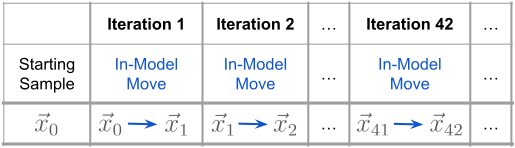
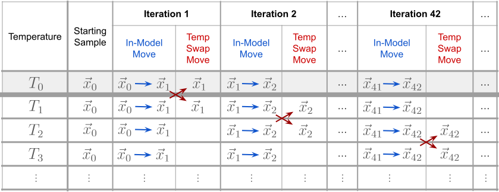

# MCMC Schematics

I found it very helpful while I was trying to figure out the steps through which my MCMC sampler would need to operate, to draw a sketch of what was happening.  Having the [pseudo-code](../mcmc_basics.md#pseudo-code-for-the-mcmc-algorithm) is a good start, and having a schematic drawn out to go with it is also very useful.  Especially as we start to build more complicated MCMCs, such as parallel tempered MCMC, or trans-dimensional MCMC.

Our MCMC sampler algorithm also needs to be able to step through various size and shape data arrays, and having a schematic drawn out is another helpful visualization of understanding the shape of the data structures we are creating.


## MCMC

A visual schematic of (standard) MCMC.  For every iteration of the sampler, we draw a new proposed parameter sample $\vec{x}_{i+1}$ and use the [acceptance ratio criteria](../mcmc_basics.md#translation-to-code-the-heart-of-the-mcmc-algorithm) to decide if we accept or reject the sample.  We will call this an "**in-model move**," because we are simply proposing a new set of parameters to "move" to for the given model we are fitting to our data.



Our model is fitting a vector $\vec{x}$ which has $N_\text{dim}$ number of dimensions.  We iterate the sampler to generate a total of $N_\text{sample}$ parameter samples.

```{note}
$$
\textbf{(Standard) MCMC data structure:} \quad \left(N_\text{sample} \ , \ N_\text{dim} \right)
$$
```


## Parallel Tempered MCMC (PTMCMC)

A visual schematic of parallel tempered MCMC.  This builds upon the structure first created with a standard MCMC, but now we create multiple copies of that MCMC - each one assigned to a "temperature."  Each MCMC copy runs in parallel, and the only other addition we now have to make in the algorithm is at every iteration we make a "**temperature swap move**," after we make our normal in-model move.

```{important}
In PTMCMC, only the parameter samples of the lowest temperature are what matter in the final results!  Hence in the schematic below, we have highlighted its row.  The higher temperature exist purely for the sake of this algorithm, and while they might be useful for final diagnostic checks, they will never be used or reported in the final analysis of the posterior!
```

The basic idea of the temperature swap move is that we pick two adjacent temperatures, and we use the temperature acceptance ratio criteria to decide if we accept or reject the sample swap between temperatures.  This gets repeated for consecutive adjacent temperatures for every iteration (then repeats once it reaches the highest two temperatures).  Different and more complicated methods can be used to pick which temperatures are selected for swapping, but shown here is the simplest one.

In practice, we may not choose to make a temperature swap move at *every* iteration as depicted in the diagram.  This figure is to understand the general structure of PTMCMC.



Since we are copying the standard MCMC algorithm here, we have a similar data structure.  But now we create $N_\text{temp}$ copies of the data structure, one for each added temperature.

```{note}
$$
\textbf{PTMCMC data structure:} \quad \left(N_\text{sample} \ , \ N_\text{temp} \ , \ N_\text{dim} \right)
$$

Remember, only the $\left(N_\text{sample} \ , \ 0 \ , \ N_\text{dim} \right)$ data structure will be used for the final analysis of the posterior!
```


