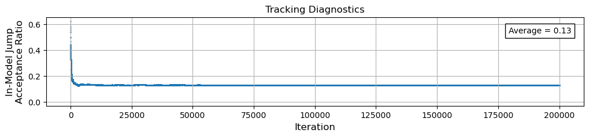

# Tracking Diagnostic: In-Model Jump Acceptance

```{tip}
Note in our [1st MCMC](../mcmc_the-bump/mcmc_the-bump.md), we simply judged our results qualitatively by eye.  It would be much better to begin quantifying our algorithm's performance.
```
One basic diagnostic that is useful to keep track of (and easy to implement) is a way to see how often an (in-model) jump proposal is accepted or rejected as the MCMC algorithm iterates.  Keeping track of the **in-model jump acceptance ratio** can then help us better understand  *quantitatively* how well our sampler is working.  As we are building our MCMC and running it and testing it, we can make changes and see how that effects the efficiency of our sampler using a diagnostic like this one.

Here we will show two possible implementations of a simple in-model jump acceptance tracking diagostic.  This will be a new ingredient we can then add into our MCMC samplers!

## Static Counter

The easiest way to track the acceptance of the in-model jumps, is simply to add a counter that starts at zero and increases by one every time an in-model jump is accepted!

```{attention}
There are only three new lines of code below:

1. Initializing the jump counter.
2. Update the jump counter by 1 each time an in-model jump is accepted.
3. Calculate the ratio of accepted jumps to total jumps to give us the static average.
```

```python
# Initialize in-model jump tracking diagnostic (static counter)
counter_jump_inmodel = 0

...
```

```python

        # Heart of the MCMC Algorithm: the acceptance criteria
        # --> (Pseudo-Code Step 5)
        if (lnprior_proposed - lnprior_current) + (lnlike_proposed - lnlike_current) + (lnjump_current - lnjump_proposed) > lnU:
            # accept the proposed sample
            x_samples[i,:] = x_proposed
            # update the in-model jump tracking diagnostic
            counter_jump_inmodel += 1

...
```

```python
# Calculate the in-model jump acceptance ratio (static average)
jump_acceptance_ratio_inmodel = counter_jump_inmodel / (Nsample-1)

print("In-Model Jump Acceptance Ratio = {0:0.2f}".format(jump_acceptance_ratio_inmodel))
```

Now when we run our sampler and calculate the above average, it will print out something like:

    In-Model Jump Acceptance Ratio = 0.13


So this gives us a high-level view of how our sampler is performing.  But it is just the overall average jump acceptance ratio for the entire run of our MCMC.

## Dynamic Counter

If instead of just a static average for our in-model jump acceptance ratio we want to see how the acceptance ratio changes over time *dynamically* as our algorithm runs, we can make just a very slight modification to the above counter!  Rather than a scalar number that increases by one every time the jump is accepted, we create an array initially filled with zeros.  Then at every iteration, if the proposed jump is accepted we store a "1" at that step.  *After* the MCMC finishes, we cummulatively sum up that array of values, and divide by the number of cumulative iterations at each step. 

```{attention}
Remember, given how we have set things up, there are a total of $N_\text{sample}-1$ jumps in our simulation.  Just be careful below to get the indices correct for this new array!
```

```python
# Initialize in-model jump tracking diagnostic (dynamic counter)
# --> store 0 (jump rejected) or 1 (jump accepted)
counter_jump_inmodel = np.zeros(Nsample-1)

...
```


```python

        # Heart of the MCMC Algorithm: the acceptance criteria
        # --> (Pseudo-Code Step 5)
        if (lnprior_proposed - lnprior_current) + (lnlike_proposed - lnlike_current) + (lnjump_current - lnjump_proposed) > lnU:
            # accept the proposed sample
            x_samples[i,:] = x_proposed
            # update the in-model jump tracking diagnostic
            counter_jump_inmodel[i-1] = 1

...
```

```{margin}
*NumPy's* [cummulative summation tool](https://numpy.org/doc/stable/reference/generated/numpy.cumsum.html) is very helpful here!  By just storing an integer "1" for the iterations where the jump is accepted, the cumulative sum of the array then gives us how many total jumps have been accepted at each step in the MCMC.  If we then divide by the total number of iterations at every step, we then have the ratio of accepted steps at every step!
```

```python
# Calculate the in-model jump acceptance ratio (dynamic)
jump_acceptance_ratio_inmodel = np.cumsum(counter_jump_inmodel) / np.arange(1,Nsample,1)
```

Now we can add this to our set of plots that we make to visualize the results of our MCMC!  This bit of code will generate a figure that looks like the following:

```python
#-----------------------
# Jump Acceptance Ratio
#-----------------------

fig, ax = plt.subplots(1,1,figsize=(12,2), sharex=True)
ax.set_ylim([0,1])

ax.scatter(np.arange(1,Nsample,1), jump_acceptance_ratio_inmodel, s=0.5)
ax.text(0.86, 0.82, 'Average = {0:0.2f}'.format(jump_acceptance_ratio_inmodel.mean()), transform=ax.transAxes, bbox=dict(color='white',ec='k'));

# Titles/Labels
ax.set_xlabel('Iteration', fontsize=12), ax.set_ylabel('In-Model Jump\nAcceptance Ratio', fontsize=12)
ax.set_title('Tracking Diagnostics')
ax.grid()

plt.show()
```


    

