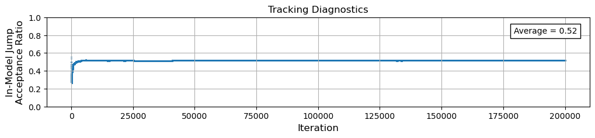
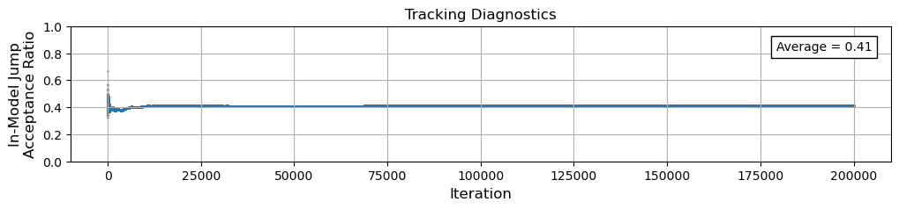
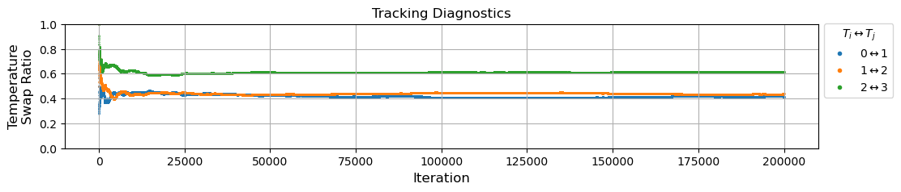

# Tracking Diagnostic: Temperature Swap Acceptance

With parallel tempering, in addition to our regular in-model jumps we now have proposed temperature swaps.  Another useful diagnostic for tracking how well our sampler is working is to see how often the temperature swaps are accepted or rejected as the MCMC algorithm iterates.  Just as we did with our [in-model jump acceptance ratio tracker](../tracking_in-model_jumps/tracking_in-model_jumps.md), let's think about how we can implement a **temperature swap acceptance ratio** tracker.

We will again show two possible implementations of a temperature swap acceptance tracking diagostic, one static and another dynamic.  This will be a new ingredient we can then add into our MCMC samplers!

```{important}
Remember, these are just examples of how you can do this.  Tracking temperature swaps is a bit more dependent on the how the temperature swaps are implemented themselves.  If you end up implementing the temperature swaping technique differently than how we show it in [this schematic](../schematics/schematics.md#parallel-tempered-mcmc-ptmcmc), then you will have to figure out how to track the temperature swaps correctly for your setup.  But hopefully this will serve to help us understand how the calculation is being made!
```

## Static Counter

Like we did with the [static in-model jump counter](../tracking_in-model_jumps/tracking_in-model_jumps.md#static-counter), let's implement a similar static temperature swap counter for each of the parallel MCMCs.  This option has the benefit of being much simpler to implement, with the limitation that it only gives us the overall average swap ratio.

The implementation will look something like this.  In this example here, we have a total of $N_\text{temp}=4$, therefore there are $N_\text{temp}-1=3$ temperature pairs that are periodically swapped, i.e. $T_0 \leftrightarrow T_1$, $T_1 \leftrightarrow T_2$, and $T_2 \leftrightarrow T_3$.


```python
# Initialize tracking diagnostics 
# --> static temperature swap counter
counter_temp_swap = np.zeros(Ntemp-1)

...
```

For every iteration, we will select two adjacent temperatures, and we will cycle through them in order from lowest temperature to highest temperature, before repeating the cycle.  We can use the current iteration to select the indices of adjacent temperatures with the following.  By using the modulo operator ('%'), we can repeat the cycle once we reach the last temperature pair!

```{margin}
We haven't yet seen the full example of the PTMCMC code - that's the next section!  I just want to focus attention on the part of the code that will be doing the temperature swap tracking, so some of the code is omitted (...) and other parts might not make complete sense without context.  If you are confused, try jumping to the next section to see the full implementation of the PTMCMC, then come back to this section!
```

```python
    # Select two temperatures and their samples to propose to swap (cycle through these at each iteration)
    # --> (PT Pseudo-Code Step 4)
    index1 = (i-1) % (Ntemp-1)
    index2 = (i-1) % (Ntemp-1) + 1

...

    # Heart of the Parallel Tempering Algorithm: the temperature acceptance criteria
    # --> (PT Pseudo-Code Step 5)
    if (1/T2 - 1/T1) * (lnlike_1 - lnlike_2) > lnU:
        # accept the proposed temperature swap
        x_samples[i,index2,:] = x_current1
        x_samples[i,index1,:] = x_current2
        # update the temperature swap tracking diagnostic (static)
        counter_temp_swap[index1] += 1     
```

Now when we run our sampler and calculate the above average, we can get a print out of the average swap ratio for each of the temperature pairs:


```python
# Calculate the in-model jump acceptance ratio (static average)
temp_swap_acceptance_ratio = counter_temp_swap / ((Nsample-1)/(Ntemp-1))  

print("Temperature Swap Acceptance Ratio = {0}".format(temp_swap_acceptance_ratio))
```

    Temperature Swap Acceptance Ratio = [0.39441394 0.45444454 0.62535625]


```{important}
Because we are *choosing* to rotate through the pairs of temperatures that get a proposed temperature swap, a given pair will have the chance at a temperature swap once every $N_\text{temp}-1$ *iterations*.  

For the static average of the in-model acceptance ratio, we divide by $N_\text{sample}-1$, but for the temperature swaps we divide by $(N_\text{sample}-1) / (N_\text{temp}-1)$.
```

## Dynamic Counter

Also like we did with the [dynamic in-model counter](../tracking_in-model_jumps/tracking_in-model_jumps.md#dynamic-counter), if we want to see how our sampler's temperature swap rates change over the course of the MCMC simulation, we can track them dynamically.

```{attention}
First off, in this example we will show how to set up *both* dynamic counters for the in-model and temperature swaps.  Remember, now we have multiple MCMCs all running in parallel, so we need to also update how we code up the in-model counter.  This will let us also track the in-model jumps for each of our parallel MCMCs!
```

Updating the in-model counter is fairly easy - we just need to add a second dimension to our data array - essentially a "column" for every one of our $N_\text{temp}$ temperatures!

But for the temperature swap counter, we are actually going to choose to set this one up as an *empty* array that is just filled with NaNs.  Again, you don't *have* to do it like how I'm choosing to do it here, there is no "unique" way of setting up this tracker.  But as we mentioned above, each temperature pair is only going to potentially make a temperature swap every $(N_\text{sample}-1) / (N_\text{temp}-1)$ samples.  So if I run a sampler with 1000 samples and 5 total temperatures (i.e. 4 total *pairs*), the temperature swap chance should only occur about 250 times for each pair.  

I would like to build a dynamic temperature swap counter array that, for a given pair of temperatures:
- updates with a "0" when a swap is rejected,
- updates with a "1" when a swap is accepted,
- and contains "NaNs" when no temperature swap proposal is made for that pair.

```python
# Initialize tracking diagnostics (dynamic counters)
counter_jump_inmodel = np.zeros((Nsample-1,Ntemp))
counter_temp_swap    = np.full((Nsample-1,Ntemp-1), np.nan)

...
```

Just a note, the in-model counter is now a *two* index array (very small modification to our earlier code for the in-model counter!).

```python
            # Heart of the MCMC Algorithm: the acceptance criteria
            # --> (MCMC Pseudo-Code Step 5)
            # --> (PT Pseudo-Code Step 1)
            if (lnprior_proposed - lnprior_current) + (lnlike_proposed - lnlike_current)/T + (lnjump_current - lnjump_proposed) > lnU:
                # accept the proposed sample
                x_samples[i,j,:] = x_proposed
                # update the in-model jump tracking diagnostic
                counter_jump_inmodel[i-1,j] = 1 

...

    # Select two temperatures and their samples to propose to swap (cycle through these at each iteration)
    # --> (PT Pseudo-Code Step 4)
    index1 = (i-1) % (Ntemp-1)
    index2 = (i-1) % (Ntemp-1) + 1

...
```

Remember, because our `counter_temp_swap` array is initialized with NaNs, once we calculate the temperature acceptance criteria we need to update it with either a "1" (accepted) or "0" (rejected).

```python
    # Heart of the Parallel Tempering Algorithm: the temperature acceptance criteria
    # --> (PT Pseudo-Code Step 5)
    if (1/T2 - 1/T1) * (lnlike_1 - lnlike_2) > lnU:
        # accept the proposed temperature swap
        x_samples[i,index2,:] = x_current1
        x_samples[i,index1,:] = x_current2
        # update the temperature swap tracking diagnostic
        counter_temp_swap[i-1,index1] = 1

    else:
        # update the temperature swap tracking diagnostic
        counter_temp_swap[i-1,index1] = 0
```

```python
# Calculate the in-model jump acceptance ratio (dynamic)
jump_acceptance_ratio_inmodel = np.cumsum(counter_jump_inmodel, axis=0) / np.arange(1,Nsample,1).reshape(-1,1)

jump_temperature_swap_ratio = ( np.ma.masked_array(counter_temp_swap, mask=np.isnan(counter_temp_swap)).cumsum(axis=0).filled(np.nan) 
                                / np.hstack([np.ones(Ntemp-1)*n for n in range(1,int(np.ceil((Nsample-1)/(Ntemp-1)+1)))])[:Nsample-1].reshape(-1,1)
```

For the `jump_acceptance_ratio_inmodel`, it is mostly what we had done before, but now we must include the `axis=0` and `.reshape(-1,1)` in order to get the correct array broadcasting operations.  But now this array structure will have the overall shape $\left(N_\text{sample}-1, N_\text{temp}\right)$, so we will be able to make a jump acceptance ratio plot for each of our tempered MCMCs!

As for the `jump_temperature_swap_ratio` - there is a lot happening in that line of code!  It is a one-line way of carrying out all of the broadcasting, NaN masking, and cummulative summing all in one go.  I suggest that if you really want to understand what is happening here, you copy/paste the code and run it, bit by bit.  But here is a general summary of what is happening:

- We want to cummulatively sum up `counter_temp_swap` like we do with `counter_jump_inmodel`, but the temp swap array contains NaNs.
- `np.ma.masked_array(counter_temp_swap, mask=np.isnan(counter_temp_swap))` puts a "mask" over the NaN values,
- and `.cumsum(axis=0)` cumulatively sums only the entries with a 1 or 0!
- `.filled(np.nan)` then fills back in the NaNs after the cummulative summation.

To get the ratio, we want to divide by the total number of times each temperature pair has proposed a temperature swap at the current iteration in the sampler.  We cannot just divide by `np.arange(1,Nsample,1).reshape(-1,1)` like we do for the `jump_acceptance_ratio_inmodel`, because each temperature pair takes turns proposing a swap.  So it isn't until we have made $N_\text{temp}-1$ iterations in the sampler that the that we move on to the next iteration in the *temperature swaps*.  Therefore `np.hstack([np.ones(Ntemp-1)*n for n ...])[:Nsample-1].reshape(-1,1)` is just a fancy way of constructing the needed array that keeps the same value of the current temperature swap iteration until all temperature pairs have been cycled through!

Again, if you want to break this down and understand it, I strongly suggest you copy/paste the code and play with it piece by piece.  It is really difficult to describe in words what is happening!

Ok now when we go to visualize our in-model acceptance ratio, I usually like to set it up so that I can first select which temperature I want to look at, then run the code to generate that temperature's plot.  So I usually do the following:

```python
# Select which temperature to use for the plots below
which_temp = 0
```

For each of my temperatures, I can now create separate copies of the burn-in, jump acceptance ratio, corner, and inference plots if I want!  Although at the end of the day the $T_0 = 1$ (i.e. `which_temp = 0`) temperature is the only one we care about, it can still be really useful to look at the other higher temperature plots when diagnosing how well our sampler is running, and if it is behaving as we would expect!

Here's an example showing how to edit and update the jump acceptance ratio plots for each temperature:

```python
#-----------------------
# Jump Acceptance Ratio
#-----------------------

fig, ax = plt.subplots(1,1,figsize=(12,2), sharex=True)
ax.set_ylim([0,1])

ax.scatter(np.arange(1,Nsample,1), jump_acceptance_ratio_inmodel[:,which_temp], s=0.5)
ax.text(0.86, 0.82, 'Average = {0:0.2f}'.format(jump_acceptance_ratio_inmodel[:,which_temp].mean()), transform=ax.transAxes, bbox=dict(color='white',ec='k'));

# Titles/Labels
ax.set_xlabel('Iteration', fontsize=12), ax.set_ylabel('In-Model Jump\nAcceptance Ratio', fontsize=12)
ax.set_title('Tracking Diagnostics')
ax.grid()

plt.show()
```




That's the lowest temperature in-model jump acceptance ratio plot.  If I want the same plot for the highest temperature (in this example, `which_temp = 3`), then I get:




For visualizing the temperature swap ratio, I usually like to put all of the temperature pairs on a single plot for direct comparison.  Something like this: 

```python
#------------------------
# Temperature Swap Ratio
#------------------------

fig, ax = plt.subplots(1,1,figsize=(12,2), sharex=True)
ax.set_ylim([0,1])

for j in range(0,Ntemp-1):
    ax.scatter(np.arange(1,Nsample,1), jump_temperature_swap_ratio[:,j], s=0.5)

# Titles/Labels
ax.set_xlabel('Iteration', fontsize=12), ax.set_ylabel('Temperature\nSwap Ratio', fontsize=12)
ax.set_title('Tracking Diagnostics')
ax.grid()

# --> manually add the markers to the legend
handles, labels = ax.get_legend_handles_labels()
point = []
for j in range(0,Ntemp-1):
    point += [Line2D([0], [0], label=r'{0:0.0f}$\leftrightarrow${1:0.0f}'.format(j,j+1), marker='.', markerfacecolor=f'C{j}', markeredgecolor=f'C{j}', linestyle='')]
handles.extend(point)

ax.legend(handles=handles, title=r'$T_i \leftrightarrow T_j$', loc='upper left', bbox_to_anchor=(1, 1.05))

plt.show()
```


